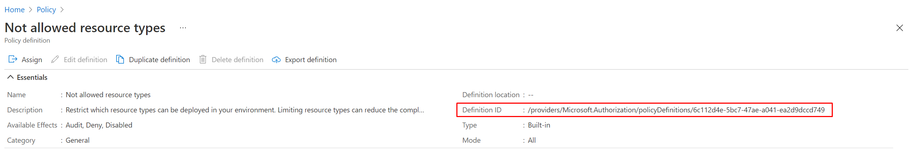

<!-- markdownlint-disable first-line-h1 -->
## Overview

This page describes how to assign built-in Azure Policies to your environment using the `caf-enterprise-scale` module.

In this example you will use two built-in policies and one built-in policy set definition. You will use policies that are not already available for assignment via the default Enterprise Scale deployment.

The policies you will use are `Not allowed resource types` and `Deploy default Microsoft IaaSAntimalware extension for Windows Server`.

The policy set definition (Initiative) you will use is `NIST SP 800-53 Rev. 5`.

> **NOTE:** You can view which policies are recommended to be assigned as part of an Enterprise Scale deployment [here](https://github.com/Azure/Enterprise-Scale/blob/main/docs/ESLZ-Policies.md).

You will update the built-in configuration by following these steps:

- Create the policy assignment files for `Not allowed resource types`, `Deploy default Microsoft IaaSAntimalware extension for Windows Server` and `NIST SP 800-53 Rev. 5`. You will also configure the `listOfResourceTypesNotAllowed` parameter within the `Not allowed resource types` assignment file to prevent the creation of Azure Firewalls
- Assign the policy definition for `Deploy default Microsoft IaaSAntimalware extension for Windows Server` at the `es_root` Management Group by extending the built-in archetype for `es_root`
- Assign the policy set definition for `NIST SP 800-53 Rev. 5` at the `es_root` Management Group by extending the built-in archetype for `es_root`
- Assign the policy definition for `Not allowed resource types` at the `Landing Zones` Management Group by extending the built-in archetype for `es_landing_zones`.

> **IMPORTANT**: To allow the declaration of custom or expanded templates, you must create a custom library folder within the root module and include the path to this folder using the `library_path` variable within the module configuration. In our example, the directory is `/lib`.

In order to assign built-in policies, there needs to be an assignment file for each policy or policy set definition that we want to use.
This module already includes assignment files for some built-in policies so it's important to check whether or not one exists before creating your own.
You can do this by navigating to  [`\modules\archetypes\lib\policy_assignments`](https://github.com/Azure/terraform-azurerm-caf-enterprise-scale/tree/main/modules/archetypes/lib) and looking for an assignment file that matches the policy you want to assign.

An example of a built-in policy that already has an assignment file included within the module is the `Kubernetes clusters should be accessible only over HTTPS` policy. The assignment file for this policy is named `policy_assignment_es_deny_http_ingress_aks.tmpl.json`.

> **NOTE:** You can view the module lib directly [here](https://github.com/Azure/terraform-azurerm-caf-enterprise-scale/tree/main/modules/archetypes/lib)

As the policies you will use in this example do not already have an assignment file within the module, you will need to create the below files so that you can assign them:

- [./lib/policy_assignments/policy_assignment_not_allowed_resource_types.json](#libpolicy_assignmentspolicy_assignment_not_allowed_resource_typesjson)
- [./lib/policy_assignments/policy_assignment_deploy_default_microsoft_IaaSAntimalware_extension_for_windows_server.json](#libpolicy_assignmentspolicy_assignment_deploy_default_microsoft_iaasantimalware_extension_for_windows_serverjson)
- [./lib/policy_assignments/policy_assignment_nist_sp_800_53_rev_5.json](#libpolicy_assignmentspolicy_assignment_nist_sp_800_53_rev_5json)

## Create Custom Policy Assignment Files

In order to assign built-in policies or policy sets, you need to create policy assignment files. The first step is to create a `policy_assignments` subdirectory within `/lib`.

> **NOTE:** Creating a `policy_assignments` subdirectory within `\lib` is a recommendation only. If you prefer not to create one or to call it something else, the custom policies will still work.

You will then need to create a file named `policy_assignment_not_allowed_resource_types.json` within the `policy_assignments` directory. Copy the below code in to the file and save it.

> **NOTE:** The full file name is not important but it does need to meet the naming conventions detailed [here](https://github.com/Azure/terraform-azurerm-caf-enterprise-scale/wiki/%5BUser-Guide%5D-Archetype-Definitions#working-with-archetype-definitions-and-the-custom-library)

To assign the correct policy, we need to provide the appropriate value for `policyDefinitionID` within our assignment file. You can retrieve the PolicyDefinitionID for your policy either through the Azure Portal, [Azure PowerShell](https://learn.microsoft.com/powershell/module/az.resources/get-azpolicydefinition?view=azps-7.3.0) or the [Azure CLI](https://learn.microsoft.com/cli/azure/policy/definition?view=azure-cli-latest)



### `lib/policy_assignments/policy_assignment_not_allowed_resource_types.json`

```json
{
    "name": "Not-Allowed-Resources",
    "type": "Microsoft.Authorization/policyAssignments",
    "apiVersion": "2019-09-01",
    "properties": {
        "description": "Restrict which resource types can be deployed in your environment. Limiting resource types can reduce the complexity and attack surface of your environment while also helping to manage costs. Compliance results are only shown for non-compliant resources.",
        "displayName": "Not allowed resources",
        "notScopes": [],
        "parameters": {
            "listOfResourceTypesNotAllowed":{
                "value": ["Microsoft.Network/azureFirewalls"]
            }
        },
        "policyDefinitionId": "/providers/Microsoft.Authorization/policyDefinitions/6c112d4e-5bc7-47ae-a041-ea2d9dccd749",
        "nonComplianceMessages": [
          {
            "message": "Resources {enforcementMode} not be in the specified types."
          }
        ],
        "scope": "${current_scope_resource_id}",
        "enforcementMode": null
    },
    "location": "${default_location}",
    "identity": {
        "type": "None"
    }
}
```

**IMPORTANT**: The `name` parameter in the assignment file has an upper limit of 24 characters. Values longer than this will result in a validation error. As an example, `"Not allowed resources` fits but `"Not allowed resource types"` would result in an error.

Now create a file named `policy_assignment_deploy_default_microsoft_IaaSAntimalware_extension_for_windows_server.json` within the `policy_assignments` directory. Copy the below code in to the file and save it.

> **NOTE:** As this policy has an effect type of `DeployIfNotExists`, you also need to tell the module to create a System Assigned Managed Identity for the policy to use. This is done within the assignment file and would also be needed for any policy with a `Modify` effect type.

### `lib/policy_assignments/policy_assignment_deploy_default_microsoft_IaaSAntimalware_extension_for_windows_server.json`

```json
{
    "name": "Deploy-Antimalware-Ext",
    "type": "Microsoft.Authorization/policyAssignments",
    "apiVersion": "2019-09-01",
    "properties": {
        "description": "This policy deploys a Microsoft IaaSAntimalware extension with a default configuration when a VM is not configured with the antimalware extension.",
        "displayName": "Deploy default Microsoft IaaSAntimalware extension for Windows Server",
        "notScopes": [],
        "parameters": {
        },
        "policyDefinitionId": "/providers/Microsoft.Authorization/policyDefinitions/2835b622-407b-4114-9198-6f7064cbe0dc",
        "nonComplianceMessages": [
          {
            "message": "Microsoft IaaSAntimalware extension {enforcementMode} be deployed when a VM is not configured with antimalware."
          }
        ],
        "scope": "${current_scope_resource_id}",
        "enforcementMode": null
    },
    "location": "${default_location}",
    "identity": {
        "type": "SystemAssigned"
    }
}
```

Finally, create an assignment file for the policy set named `policy_assignment_nist_sp_800_53_rev_5.json` within the `policy_assignments` directory. Copy the below code in to the file and save it.

### `lib/policy_assignments/policy_assignment_nist_sp_800_53_rev_5.json`

```json
{
    "name": "NIST-SP-800-53-Rev5",
    "type": "Microsoft.Authorization/policyAssignments",
    "apiVersion": "2019-09-01",
    "properties": {
        "description": "This initiative includes policies that address a subset of NIST SP 800-53 Rev. 5 controls. Additional policies will be added in upcoming releases. For more information, visit https://aka.ms/nist800-53r5-initiative.",
        "displayName": "NIST SP 800-53 Rev. 5",
        "notScopes": [],
        "parameters": {
        },
        "policyDefinitionId": "/providers/Microsoft.Authorization/policySetDefinitions/179d1daa-458f-4e47-8086-2a68d0d6c38f",
        "nonComplianceMessages": [
          {
            "message": "NIST SP 800-53 Rev. 5 controls {enforcementMode} be enforced"
          }
        ],
        "scope": "${current_scope_resource_id}",
        "enforcementMode": null
    },
    "location": "${default_location}",
    "identity": {
        "type": "SystemAssigned"
    }
}
```

## Assign the `Deploy default Microsoft IaaSAntimalware extension for Windows Server` Policy at the `es_root` Management Group

You now need to assign the `Deploy default Microsoft IaaSAntimalware extension for Windows Server` policy and in this example, we will assign it at `es_root`. If you don't already have an `archetype_extension_es_root.tmpl.json` file within your custom `/lib` directory, create one and copy the below code in to the file.

```json
{
  "extend_es_root": {
    "policy_assignments": ["Deploy-Antimalware-Ext"],
    "policy_definitions": [],
    "policy_set_definitions": [],
    "role_definitions": [],
    "archetype_config": {
      "access_control": {
      }
    }
  }
}
```

You should now kick-off your Terraform workflow (init, plan, apply) to apply the new configuration. This can be done either locally or through a pipeline. When your workflow has finished, the `Deploy default Microsoft IaaSAntimalware extension for Windows Server` policy will be assigned at `es_root`.

## Assign the `NIST SP 800-53 Rev. 5` Policy Set at the `es_root` Management Group

You now need to assign the `NIST SP 800-53 Rev. 5` policy set and in this example, we will assign it at `es_root`. Copy the below code in to your `archetype_extension_es_root.tmpl.json` file and save it.

```json
{
  "extend_es_root": {
    "policy_assignments": ["Deploy-Antimalware-Ext", "NIST-SP-800-53-Rev5"],
    "policy_definitions": [],
    "policy_set_definitions": [],
    "role_definitions": [],
    "archetype_config": {
      "access_control": {
      }
    }
  }
}
```

You should now kick-off your Terraform workflow (init, plan, apply) to apply the new configuration. This can be done either locally or through a pipeline. When your workflow has finished, the `NIST SP 800-53 Rev. 5` policy set will be assigned at `es_root`.

## Assign the `Not allowed resource types` Policy at the `Landing Zones` Management Group

In this example, we will assign it at the `Landing Zones` Management Group. To do this, either update your existing `archetype_extension_es_landing_zones.tmpl.json` file or create one and copy the below code in to it and save.

```json
{
  "extend_es_landing_zones": {
    "policy_assignments": ["Not-Allowed-Resources"],
    "policy_definitions": [],
    "policy_set_definitions": [],
    "role_definitions": [],
    "archetype_config": {
      "access_control": {
      }
    }
  }
}
```

You should now kick-off your Terraform workflow once again to apply the updated configuration. This can be done either locally or through a pipeline. When your workflow has finished, the `Not allowed resource types` policy will be assigned at the `Landing Zones` Management Group.

You have now successfully assigned a built-in Policy Definition and a built-in Policy Set Definition within your Azure environment. You can re-use the guidance in this article for any other built-in policies that you may wish to use within your environment.
