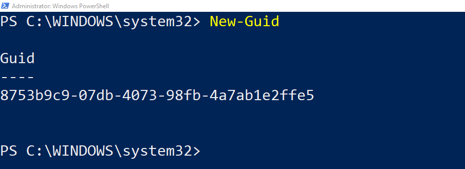

<!-- markdownlint-disable first-line-h1 -->
## Overview

This page describes how to use the module to create your own custom RBAC roles and assign them at the appropriate scopes within your Azure landing zone deployment.

In this example, we will create a custom RBAC role with the name "Reader Support Tickets" which will allow members to read everything in a subscription and to also open support tickets.

We will then assign the new RBAC Role at the `es_landing_zones` scope.

We will update the built-in configuration with the new custom RBAC role by following these steps:

- Create the role definition file

- Save the new role at the `es_root` scope

- Assign the role at the `es_landing_zones` scope

The files we will use are:

- [lib/role_definitions/role_definition_es_reader_support_tickets.tmpl.json](#librole_definitionsrole_definition_es_reader_support_ticketstmpljson)
- [lib/archetype_extension_es_root.tmpl.json](#libarchetype_extension_es_roottmpljson)
- [lib/archetype_extension_es_landing_zones.tmpl.json](#libarchetype_extension_es_landing_zonestmpljson)

>**IMPORTANT**: To allow the declaration of custom or expanded templates, you must create a custom library folder within the root module and include the path to this folder using the `library_path` variable within the module configuration. In our example, the directory is `lib`.

## Create Role Definition File

In your `lib` directory create a `role_definitions` subdirectory if you don't already have one. You can learn more about archetypes and custom libraries in [this article](https://github.com/Azure/terraform-azurerm-caf-enterprise-scale/wiki/%5BUser-Guide%5D-Archetype-Definitions).

> **NOTE:** Creating a `role_definitions` subdirectory is a recommendation only. If you prefer not to create one or to call it something else, the custom roles will still work.

In the `role_definitions` subdirectory, create a `role_definition_es_reader_support_tickets.tmpl.json` file. This file will contain the role definition for our `Reader Support Tickets` role.

We need to ensure that every custom role we create has a unique value for "name". To do that, there are a number of tooling options we can use, including:

- The `New-Guid` PowerShell cmdlet
- The *nix tool `uuidgen`
- The `uuidv5` function that is built-in to Terraform.

> **NOTE:** This isn't an exhaustive list. As long as the generated value is unique, the tool used isn't important.

In this example, we will use `New-Guid` to generate the name value for our `Reader-Support-Tickets` role definition. Using `New-Guid` is as simple as opening a PowerShell window and running the `New-Guid` cmdlet. It will then generate a unique value for you to use.



Now that we have a unique "name" for our new role definition, copy the below code in to the `role_definition_es_reader_support_tickets.tmpl.json` file and save it, making sure to update the value of "name" with your result from running `New-Guid`.

### `lib/role_definitions/role_definition_es_reader_support_tickets.tmpl.json`

```json
{
    "name": "8753b9c9-07db-4073-98fb-4a7ab1e2ffe5",
    "type": "Microsoft.Authorization/roleDefinitions",
    "apiVersion": "2018-01-01-preview",
    "properties": {
        "roleName": "Reader-Support-Tickets",
        "description": "View everything in the subscription and also open support tickets.",
        "type": "customRole",
        "permissions": [
            {
                "actions": [
                    "*/read",
                    "Microsoft.Support/*"
                ],
                "notActions": [],
                "dataActions": [],
                "notDataActions": []
            }
        ],
        "assignableScopes": [
            "${current_scope_resource_id}"
        ]
    }
}
```

## Assign Role

To assign a custom role, we need to expand upon the built-in configuration by using `archetype extensions`.
You can learn more about archetype extensions in [this article](https://github.com/Azure/terraform-azurerm-caf-enterprise-scale/wiki/%5BExamples%5D-Expand-Built-in-Archetype-Definitions).

If you don't already have an `archetype_extension_es_root.tmpl.json` file within your custom `lib` directory, create one and copy the below code in to the file.
This code will save your new `Reader-Support-Tickets` role at this scope and allow it to be used either at the `es_root` scope or below.

### `lib/archetype_extension_es_root.tmpl.json`

```json
{
  "extend_es_root": {
    "policy_assignments": [],
    "policy_definitions": [],
    "policy_set_definitions": [],
    "role_definitions": ["Reader-Support-Tickets"],
    "archetype_config": {
      "parameters": {},
      "access_control": {}
    }
  }
}
```

If you don't already have an `archetype_extension_es_landing_zones.tmpl.json` file within your custom `lib` directory, create one and copy the below code in to the file.
This code will assign your new `Reader-Support-Tickets` role to a group named `Contoso Reader and Support Tickets`.
In order to assign the `Reader-Support-Tickets` role to the group, you need to use the groups objectID which can be located in Microsoft Entra ID.

Instead of group, if you would like to assign the role to a SPN in the form of application registered in Microsoft Entra ID then make sure to use the Object ID of the Service Principal related to that application which you can find from the "Enterprise applications" blade of Microsoft Entra ID Portal.
For more details on the relation between application and service principal objects please see [this article](https://learn.microsoft.com/azure/active-directory/develop/app-objects-and-service-principals).

>**IMPORTANT**: Due to how the module works, you must prefix your role name with the location at which it has been saved. In our example this would be `"[CONTOSO]"`.
If we had saved our role at the `es_landing_zones` scope then we would use a prefix of `"[CONTOSO-LANDING-ZONES]"`

### `lib/archetype_extension_es_landing_zones.tmpl.json`

```json
{
  "extend_es_landing_zones": {
    "policy_assignments": [],
    "policy_definitions": [],
    "policy_set_definitions": [],
    "role_definitions": [],
    "archetype_config": {
      "parameters": {},
      "access_control": {
        "[CONTOSO] Reader-Support-Tickets": ["2f449a58-06b8-48a2-b60c-9107be0ca878"]
      }
    }
  }
}
```

>**IMPORTANT**: Remember to replace the GUID in the code above with the objectID of the group you're assigning the role to in your own tenant.

You should now kick-off your Terraform workflow (init, plan, apply) again to apply the updated configuration. This can be done either locally or through a pipeline.
When your workflow has finished, the `Reader-Support-Tickets` role will be assigned to the `Contoso Reader and Support Tickets` group at the Landing Zones Management Group.
