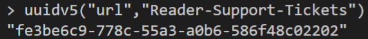

## Overview

This page describes how to use the module to create your own custom RBAC roles and assign them at the appropriate scopes within your Enterprise-Scale deployment.

In this example, we will create a custom RBAC role called "Reader Support Tickets" which will allow members to read everything in a subscription and to also open support tickets.

We will then assign the new RBAC Role at the `es_landingzones` scope.

We will update the built-in configuration with the new custom RBAC role by following these steps:

- Create the role definition file 

- Save the new role at the `es_root` scope

- Assign the role at the `es_landingzones` scope

>IMPORTANT: To allow the declaration of custom or expanded templates, you must create a custom library folder within the root module and include the path to this folder using the `library_path` variable within the module configuration. In our example, the directory is `/lib`.

## Create Role Definition File

In your `/lib` directory create a `role_definitions` subdirectory if you don't already have one. You can learn more about archetypes and custom libraries in [this article](https://github.com/Azure/terraform-azurerm-caf-enterprise-scale/wiki/%5BUser-Guide%5D-Archetype-Definitions).

>NOTE: Creating a `role_definitions` subdirectory is a recommendation only. If you prefer not to create one or to call it something else, the custom roles will still work.

In the `role_definitions` subdirectory, create a `role_definition_es_reader_support_tickets.tmpl.json` file. This file will contain the role definition for our `Reader Support Tickets` role. 

To attempt to ensure that every custom role we create has a unique value for "name", we use the uuidv5 function that is built-in to Terraform. You can learn more about uuidv5 [here](https://www.terraform.io/language/functions/uuidv5).

To use uuidv5, we must first open the Terraform Console. Do this by running `terraform console` from your terminal.

>NOTE: It can some time for the console to open.

When the console has loaded, you will need to run the following code `uuidv5("url","Reader-Support-Tickets")` and hit enter. uuidv5 will then generate a UUID that we can use for the name value within our Custom Role Definition. For this example, your output should match the below:



>IMPORTANT: uuidv5 is case sensitive so be sure to type the name of your custom role correctly

Now that we have a unique "name" for our new role definition, copy the below code in to the `role_definition_es_reader_support_tickets.tmpl.json` file and save it.

### `lib/role_definitions/role_definition_es_reader_support_tickets.tmpl.json`

```json
{
    "name": "fe3be6c9-778c-55a3-a0b6-586f48c02202",
    "type": "Microsoft.Authorization/roleDefinitions",
    "apiVersion": "2018-01-01-preview",
    "properties": {
        "roleName": "Reader-Support-Tickets",
        "description": "View everything in the subscription and also open support tickets.",
        "type": "customRole",
        "permissions": [
            {
                "actions": [
                    "*/read",
                    "Microsoft.Support/*"
                ],
                "notActions": [],
                "dataActions": [],
                "notDataActions": []
            }
        ],
        "assignableScopes": [
            "${current_scope_resource_id}"
        ]
    }
}
```

## Assign Role

To assign a custom role, we need to expand upon the built-in configuration by using `archetype extensions`. 
You can learn more about archetype extensions in [this article](https://github.com/Azure/terraform-azurerm-caf-enterprise-scale/wiki/%5BExamples%5D-Expand-Built-in-Archetype-Definitions).

If you don't already have an `archetype_extension_es_root.tmpl.json` file within your custom `/lib` directory, create one and copy the below code in to the file. 
This code will save your new `Reader-Support-Tickets` role at this scope and allow it to be used either at the `es_root` scope or below.

```json
{
  "extend_es_root": {
    "policy_assignments": [],
    "policy_definitions": [],
    "policy_set_definitions": [],
    "role_definitions": ["Reader-Support-Tickets"],
    "archetype_config": {
      "parameters": {},
      "access_control": {}
    }
  }
}
```

If you don't already have an `archetype_extension_es_landing_zones.tmpl.json` file within your custom `/lib` directory, create one and copy the below code in to the file. 
This code will assign your new `Reader-Support-Tickets` role to a group named `Contoso Reader and Support Tickets`.
In order to assign the `Reader-Support-Tickets` role to the group, you need to use the groups objectID which can be located in Azure Active Directory.

>IMPORTANT: Due to how the module works, you must prefix your group name with the location at which it has been saved. In our example this would be `"[CONTOSO]"`.
If we had saved our role at the `es_landingzones` scope then we would use a prefix of `"[CONTOSO-LANDING-ZONES]"`

```json
{
  "extend_es_landing_zones": {
    "policy_assignments": [],
    "policy_definitions": [],
    "policy_set_definitions": [],
    "role_definitions": [],
    "archetype_config": {
      "parameters": {},
      "access_control": {
        "[CONTOSO] Reader-Support-Tickets": ["2f449a58-06b8-48a2-b60c-9107be0ca878"]
      }
    }
  }
}
```

You should now kick-off your Terraform workflow (init, plan, apply) again to apply the updated configuration. This can be done either locally or through a pipeline. 
When your workflow has finished, the `Reader-Support-Tickets` role will be assigned to the `Contoso Reader and Support Tickets` group at the Landing Zones Management Group.