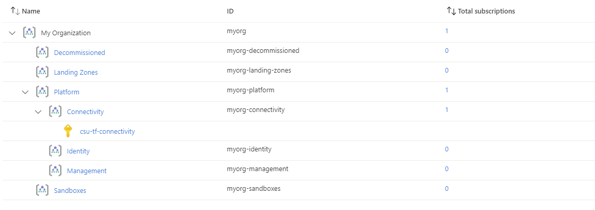
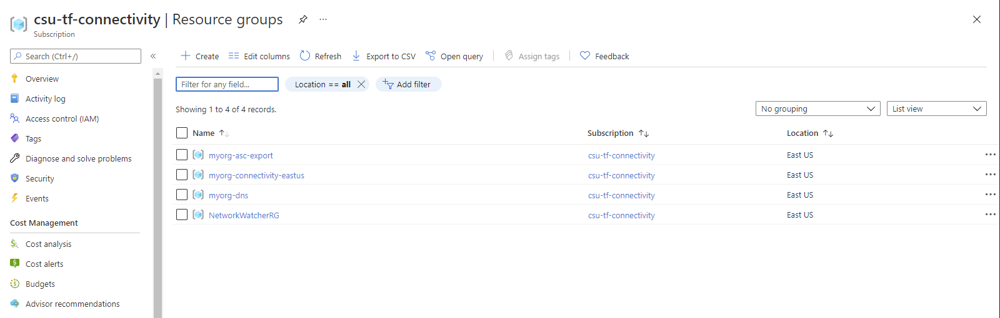
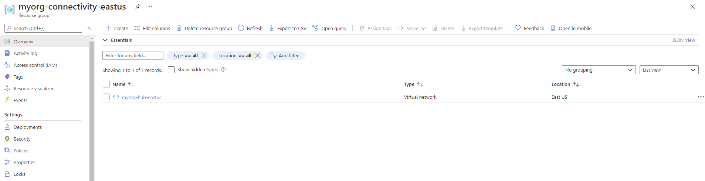
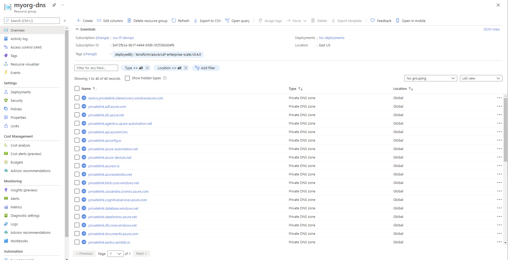

## Overview

This page describes how to deploy Enterprise-scale with the [Connectivity resources][wiki_connectivity_resources] created in the current Subscription context, using the default configuration settings.

As connectivity resources can start to significantly increase Azure consumption costs, the module defaults are aimed to help build the basic connectivity configuration whilst minimising cost.
Please refer to the Cloud Adoption Framework [Network topology and connectivity][ESLZ-Connectivity] recommendations to better understand which of these settings you should enable in a Production environment.

In this example, we take the [default configuration][wiki_deploy_default_configuration] and make the following changes:

- Set `deploy_connectivity_resources` to enable creation of the default Connectivity resources, including:
  - Resource Group to contain all Connectivity resources.
  - Virtual Network to use as a hub for hybrid-connectivity.
  - Azure Private DNS Zones for Private Endpoints.
  - Recommended Solutions for Azure Monitor.
- Set the `subscription_id_connectivity` value to ensure the Subscription is moved to the correct Management Group, and policies are updated with the correct values.

The module updates the `parameters` and `enforcement_mode` for a number of Policy Assignments, to enable features relating to the DDoS Protection Plan and Private DNS Zones for Private Endpoints.

<!-- Some Private DNS Zones for Private Endpoints are bound to a specific Azure Region.
By default, the module will use the location set for connectivity resources, or the `default_location` value (`eastus`), in order of precedence.
To add more locations, simply add them to the `configure_connectivity_resources.settings.dns.config.private_link_locations` value.
This must be in the short format (`uksouth`), and not DisplayName (`UK South`). -->

> IMPORTANT: Ensure the module version is set to the latest, and don't forget to run `terraform init` if upgrading to a later version of the module.


## Example root module

To create the Connectivity resources, `deploy_connectivity_resources` must be set to `true`, and the `subscription_id_connectivity` is also required.

Although `subscription_id_connectivity` is required, the create of resources is determined by provider settings.
Please ensure you have a provider configured with access to the same Subscription specified by `subscription_id_connectivity`, and map this to `azurerm.connectivity` in the module providers object.

> TIP: The exact number of resources created depends on the module configuration, but you can expect upwards of 260 resources to be created by the module for this example.

To keep this example simple, the root module for this example is based on a single file:

### `main.tf`

```hcl
# We strongly recommend using the required_providers block to set the
# Azure Provider source and version being used.

terraform {
  required_providers {
    azurerm = {
      source  = "hashicorp/azurerm"
      version = ">= 2.77.0"
    }
  }
}

provider "azurerm" {
  features {}
}

# You can use the azurerm_client_config data resource to dynamically
# extract connection settings from the provider configuration.

data "azurerm_client_config" "core" {}

# Call the caf-enterprise-scale module directly from the Terraform Registry
# pinning to the latest version

module "enterprise_scale" {
  source  = "Azure/caf-enterprise-scale/azurerm"
  version = "1.1.0"

  providers = {
    azurerm              = azurerm
    azurerm.connectivity = azurerm
    azurerm.management   = azurerm
  }

  root_parent_id = data.azurerm_client_config.core.tenant_id
  root_id        = "myorg"
  root_name      = "My Organization"

  deploy_connectivity_resources = true
  subscription_id_connectivity  = data.azurerm_client_config.core.subscription_id

}
```

## Deployed Management Groups



You have successfully created the default Management Group resource hierarchy, along with the recommended Azure Policy and Access control (IAM) settings for Enterprise-scale.

You have also assigned the current Subscription from your provider configuration to the `connectivity` Management Group.

## Policy Assignment configuration

Check the following Policy Assignments to see how these have been configured with default settings for parameters and enforcement mode:

- Scope = `connectivity`
  - `Enable-DDoS-VNET`
- Scope = `corp`
  - `Deploy-Private-DNS-Zones`

> You may want to [Deploy Connectivity Resources With Custom Settings][wiki_deploy_connectivity_resources_custom] to change some of these settings.

## Deployed Connectivity resources

Once deployment is complete and policy has run, you should have the following Resource Groups deployed in your assigned Connectivity Subscription:



> **NOTE:** `myorg-asc-export` is related to the [Management resources][wiki_management_resources].
This should contain a hidden `microsoft.security/automations` resource `ExportToWorkspace` once the [Management resources][wiki_management_resources] are configured and Azure Policy has completed remediation.
`NetworkWatcherRG` is also automatically generated by policy as part of the Virtual Network creation.

### Resource Group `myorg-connectivity-eastus`

The Resource Group `myorg-connectivity-eastus` should be created, and will initially contain a single Virtual Network called `myorg-hub-eastus`.



When you explore the configuration, note that `myorg-hub-eastus` is pre-configured with Subnets for `GatewaySubnet` and `AzureFirewallSubnet`.
DDoS Protection Standard should also be set to `Disable`, although we recommend you **enable this for production environments**.
The location of both the Resource Group and Virtual Network is created in the region specified via the `default_location` input variable, which uses the default value of `eastus` in this example.
These settings can all be changed if needed!

### Resource Group `myorg-dns`

As DNS resource are `Global` resources, the Resource Group is created in the region specified via the `default_location` input variable, which uses the default value of `eastus` in this example.
All Private DNS Zone resources are `Global`.



By default we create a Private DNS Zone for all services which currently [support Private Endpoints][azure_private_endpoint_support].
New Private DNS Zones may be added in future releases as additional services release Private Endpoint support.

We also configure `Virtual network links` to connect each Private DNS Zone to the hub Virtual Network, which in this example is `myorg-hub-eastus`.

## Additional considerations

If you are using [Archetype Exclusions][archetype_exclusions] or [custom Archetypes][custom_archetypes] in your code, make sure to not disable DDoS or DNS policies if you require policy integration using this module.
The relationship between the resources deployed and the Policy parameters is dependent on [specific Policy Assignments](#policy-assignment-configuration) being used.

## Next steps

Go to our next example to learn how to deploy the [Connectivity resources with custom settings][wiki_deploy_connectivity_resources_custom].

For more information regarding configuration of this module, please refer to the [Module Variables](./%5BUser-Guide%5D-Module-Variables) documentation.

Looking for further inspiration? Why not try some of our other [examples][wiki_examples]?

[//]: # "************************"
[//]: # "INSERT LINK LABELS BELOW"
[//]: # "************************"

[ESLZ-Connectivity]: https://docs.microsoft.com/azure/cloud-adoption-framework/ready/enterprise-scale/network-topology-and-connectivity

[azure_private_endpoint_support]: https://docs.microsoft.com/azure/private-link/private-endpoint-dns#azure-services-dns-zone-configuration "Azure services DNS zone configuration"

[wiki_connectivity_resources]:               ./%5BUser-Guide%5D-Connectivity-Resources "Wiki - Connectivity Resources"
[wiki_deploy_connectivity_resources_custom]: ./%5BExamples%5D-Deploy-Connectivity-Resources-With-Custom-Settings "Wiki - Deploy Connectivity Resources With Custom Settings"
[wiki_examples]:                             ./Examples "Wiki - Examples"
[wiki_management_resources]:                 ./%5BUser-Guide%5D-Management-Resources "Wiki - Management Resources"
[wiki_deploy_default_configuration]:         ./%5BExamples%5D-Deploy-Default-Configuration "Wiki - Deploy Default Configuration"

[archetype_exclusions]: ./%5BExamples%5D-Expand-Built-in-Archetype-Definitions#to-enable-the-exclusion-function "Wiki - Expand Built-in Archetype Definitions # To enable the exclusion function"
[custom_archetypes]:    ./%5BUser-Guide%5D-Archetype-Definitions "[User Guide] Archetype Definitions"
