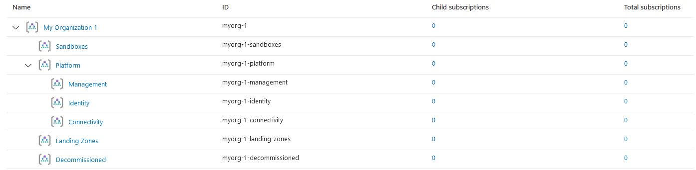

## Overview

This example code will deploy the minimum recommended management group and subscription organization from the enterprise-scale reference architecture.
You can then start to customize your deployment once you've got this up and running.

This is a good starting point when first discovering what resources are created by this module.

> IMPORTANT: Ensure the module version is set to the latest, and don't forget to run `terraform init` if upgrading to a later version of the module.


## Example root module

> TIP: Although only `root_parent_id` is required, we recommend setting `root_id` and `root_name` to something more meaningful. Changing `root_id` will result in the entire deployment to be re-provisioned.

To keep things simple, the root module for this example is based on a single file:

### `main.tf`

```hcl
# We strongly recommend using the required_providers block to set the
# Azure Provider source and version being used.

terraform {
  required_providers {
    azurerm = {
      source  = "hashicorp/azurerm"
      version = ">= 2.77.0"
    }
  }
}

provider "azurerm" {
  features {}
}

# You can use the azurerm_client_config data resource to dynamically
# extract connection settings from the provider configuration.

data "azurerm_client_config" "core" {}

# Call the caf-enterprise-scale module directly from the Terraform Registry
# pinning to the latest version

module "enterprise_scale" {
  source  = "Azure/caf-enterprise-scale/azurerm"
  version = "1.1.0"

  providers = {
    azurerm              = azurerm
    azurerm.connectivity = azurerm
    azurerm.management   = azurerm
  }

  root_parent_id = data.azurerm_client_config.core.tenant_id
  root_id        = "myorg"
  root_name      = "My Organization"

}
```

## Deployed Management Groups



You have successfully created the default Management Group resource hierarchy, along with the recommended Azure Policy and Access control (IAM) settings for Enterprise-scale.

> TIP: The exact number of resources created depends on the module configuration, but you can expect upwards of 200 resources to be created by this module for a default installation.

## Next steps

Go to our next example to learn how to deploy the [demo landing zone archetypes](./%5BExamples%5D-Deploy-Demo-Landing-Zone-Archetypes).