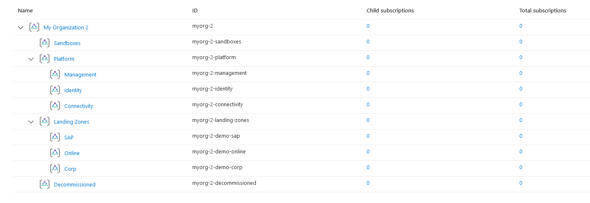

## Overview

This page describes how to deploy Enterprise-scale with a starter configuration based mainly on module defaults, including the additional Management Groups used for demonstrating the Enterprise-scale Landing Zone archetypes:

- Corp
- Online
- SAP

These demo Landing Zone archetypes provides a good way to learn about archetypes within the Enterprise-scale architecture but should not be used for production workloads.

> IMPORTANT: Ensure the module version is set to the latest, and don't forget to run `terraform init` if upgrading to a later version of the module.


> TIP: What is an archetype?
> An archetype defines which Azure Policy and Access control (IAM) settings are needed to secure and configure the Landing Zones with everything needed for safe handover to the Landing Zone owner.
> The archetype is what fundamentally transforms Management Groups and Subscriptions into Landing Zones.

## Example root module

> NOTE: Although only `root_parent_id` is required, we recommend setting `root_id` and `root_name` to something more meaningful. Changing `root_id` will result in the entire deployment to be re-provisioned.

To keep things simple, the root module for this example is based on a single file:

### `main.tf`

```hcl
# We strongly recommend using the required_providers block to set the
# Azure Provider source and version being used.

terraform {
  required_providers {
    azurerm = {
      source  = "hashicorp/azurerm"
      version = ">= 2.77.0"
    }
  }
}

provider "azurerm" {
  features {}
}

# You can use the azurerm_client_config data resource to dynamically
# extract connection settings from the provider configuration.

data "azurerm_client_config" "core" {}

# Declare the Terraform Module for Cloud Adoption Framework
# Enterprise-scale and provide a base configuration.

module "enterprise_scale" {
  source  = "Azure/caf-enterprise-scale/azurerm"
  version = "1.1.0"

  providers = {
    azurerm              = azurerm
    azurerm.connectivity = azurerm
    azurerm.management   = azurerm
  }

  root_parent_id = data.azurerm_client_config.core.tenant_id
  root_id        = "myorg"
  root_name      = "My Organization"

  deploy_demo_landing_zones = true

}
```

## Deployed Management Groups



You have successfully created the default Management Group resource hierarchy including additional Management Groups for demonstrating Landing Zone archetypes, along with the recommended Azure Policy and Access control (IAM) settings for Enterprise-scale.

> TIP: The exact number of resources created depends on the module configuration, but you can expect upwards of 200 resources to be created by this module for a default installation.

## Next steps

Go to our next example to learn how to create your own [custom landing zone archetypes](./%5BExamples%5D-Deploy-Custom-Landing-Zone-Archetypes).