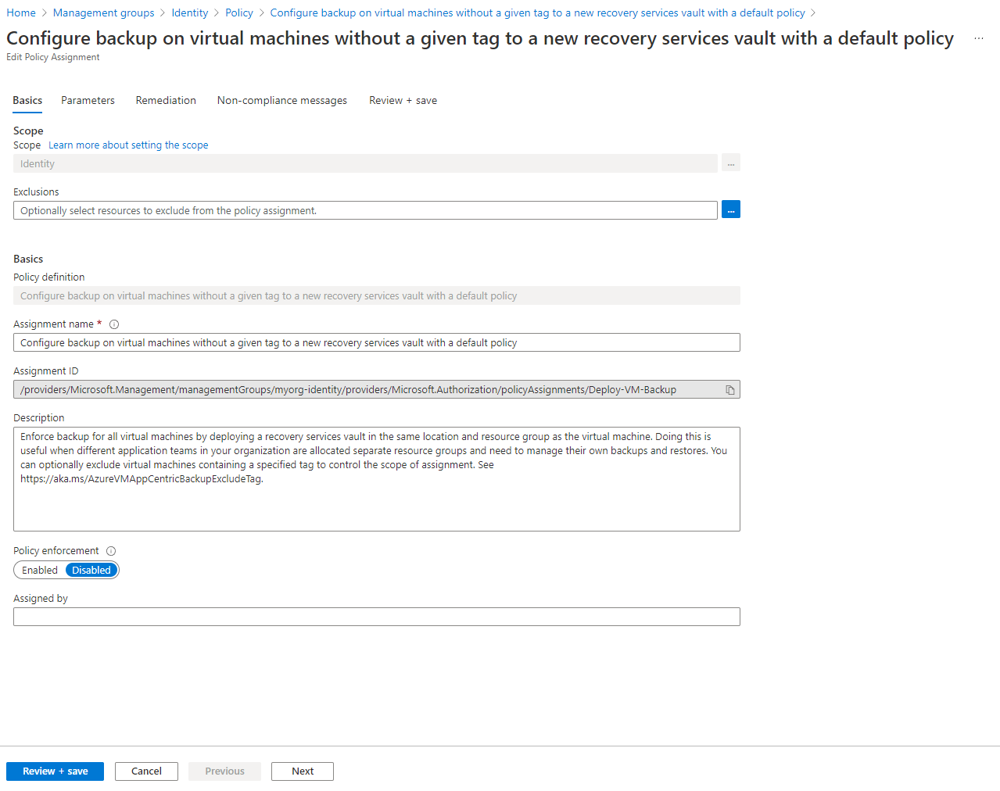

## Overview

This page describes how to deploy Enterprise-scale with the [Identity resources][wiki_identity_resources] created in the current Subscription context, using custom configuration settings.

Unlike the `connectivity` and `management` solutions, no resources are currently deployed when enabling `deploy_identity_resources`.
Instead, the Policy Assignments associated with the `identity` Management Group are enabled and configured based on the optional `configure_identity_resources` input variable.
The module will also move the Subscription specified in `subscription_id_identity` to the `identity` Management Group, unless it is the same value specified in `subscription_id_connectivity` or `subscription_id_management`.

For the Identity resources, it is still possible to configure a number of policy settings through the [`configure_identity_resources`][configure_identity_resources] input variable.

In this example, we take the base [Deploy Identity resources][wiki_deploy_identity_resources] configuration and make the following changes:

- Add input variable on the root module for enabling/disabling Identity resources
- Add a local variable for `configure_identity_resources` and set custom values for the following:
  - Disable the `DeployIfNotExists` policy used to deploy and configure Azure Backup for Virtual Machines

> Due to the way the Azure RM Provider manages dependencies, you may see a number of `azurerm_role_assignment` resources being replaced when updating Policy Assignments.
Unfortunately this is a product limitation, but should have minimal impact due to the way Azure Policy works.

If you've already deployed the [Identity resources using default settings][wiki_deploy_identity_resources], you will be able to see the changes made when moving to this configuration.

> IMPORTANT: Ensure the module version is set to the latest, and don't forget to run `terraform init -upgrade` if upgrading to a later version of the module.


## Example root module

To make the code easier to maintain when extending your configuration, we recommend splitting the root module into multiple files. For the purpose of this example, we use the following:

- [terraform.tf](#terraformtf)
- [variables.tf](#variablestf)
- [main.tf](#maintf)
- [settings.identity.tf](#settingsidentitytf)

> TIP: The exact number of resources created depends on the module configuration, but you can expect upwards of 180 resources to be created by the module for this example.

### `terraform.tf`

The `terraform.tf` file is used to set the provider configuration, including pinning to a specific version (or range of versions) for the AzureRM Provider. For production use, we recommend pinning to a specific version, and not using ranges.

```hcl
# Configure Terraform to set the required AzureRM provider
# version and features{} block.

terraform {
  required_providers {
    azurerm = {
      source  = "hashicorp/azurerm"
      version = ">= 2.77.0"
    }
  }
}

provider "azurerm" {
  features {}
}
```

If you wish to assign a different Subscription to the `identity` Management Group than the one used for deploying Core resources, please refer to our guide for [Multi-Subscription deployment][wiki_provider_configuration_multi].

### `variables.tf`

The `variables.tf` file is used to declare a couple of example variables which are used to customize deployment of this root module. Defaults are provided for simplicity, but these should be replaced or over-ridden with values suitable for your environment.

```hcl
# Use variables to customize the deployment

variable "root_id" {
  type    = string
  default = "myorg"
}

variable "root_name" {
  type    = string
  default = "My Organization"
}

variable "deploy_identity_resources" {
  type    = bool
  default = true
}
```

### `main.tf`

The `main.tf` file contains the `azurerm_client_config` resource, which is used to determine the Tenant ID and Subscription ID values from your user connection to Azure. These are used to ensure the deployment will target your `Tenant Root Group` by default, and to populate the `subscription_id_identity` input variable.

It also contains the module declaration for this module, containing a number of customisations as needed to meet the specification defined in the overview above.

```hcl
# Get the current client configuration from the AzureRM provider.
# This is used to populate the root_parent_id variable with the
# current Tenant ID used as the ID for the "Tenant Root Group"
# Management Group.

data "azurerm_client_config" "core" {}

# Declare the Terraform Module for Cloud Adoption Framework
# Enterprise-scale and provide a base configuration.

module "enterprise_scale" {
  source  = "Azure/caf-enterprise-scale/azurerm"
  version = "1.1.0"

  providers = {
    azurerm              = azurerm
    azurerm.connectivity = azurerm
    azurerm.management   = azurerm
  }

  root_parent_id = data.azurerm_client_config.core.tenant_id
  root_id        = var.root_id
  root_name      = var.root_name

  deploy_identity_resources    = var.deploy_identity_resources
  subscription_id_identity     = data.azurerm_client_config.core.subscription_id
  configure_identity_resources = local.configure_identity_resources

}
```

### `settings.identity.tf`

The `settings.identity.tf` file contains a local variable containing the custom configuration for the `configure_identity_resources` input variable.
This helps to keep the module block clean, whilst providing clear separation between settings for different groups of resources.

```hcl
# Configure the identity resources settings.
locals {
  configure_identity_resources = {
    settings = {
      identity = {
        enabled = true
        config = {
          enable_deny_public_ip             = true
          enable_deny_rdp_from_internet     = true
          enable_deny_subnet_without_nsg    = true
          enable_deploy_azure_backup_on_vms = false
        }
      }
    }
  }
}
```

## Deployed Management Groups


You have successfully created the default Management Group resource hierarchy, along with the recommended Azure Policy and Access control (IAM) settings for Enterprise-scale.

You have also assigned the current Subscription from your provider configuration to the `identity` Management Group.

## Policy Assignment configuration

Check the following Policy Assignments to see how these have been configured with settings matching your Identity resources configuration set by `configure_identity_resources`:

- Scope = `identity`
  - `Deny-Public-IP`
  - `Deny-RDP-From-Internet`
  - `Deny-Subnet-Without-Nsg`
  - `Deploy-VM-Backup`

These Policy Assignments should all be assigned with custom parameter values based on your configuration, with `enforcement_mode` correctly set.
Once evaluated, the compliance state should also be updated and you can run remediation tasks to remediate any non-compliant resources.

In this example, only `Deploy-VM-Backup` will be re-configured. In this case, we are simply setting `enforcement_mode` to `DoNotEnforce`.



## Deployed Identity resources

No resources will be deployed in your `identity` Subscription by this module.

## Additional considerations

If you are using [Archetype Exclusions][archetype_exclusions] or [custom Archetypes][custom_archetypes] in your code, make sure to not disable the policies listed above if you require policy integration using this module.
The relationship between the resources deployed and the Policy parameters is dependent on [specific Policy Assignments](#policy-assignment-configuration) being used.

## Next steps

Try toggling some of the other values in `local.configure_identity_resources`, or setting `var.deploy_identity_resources` to `false`.

For more information regarding configuration of this module, please refer to the [Module Variables](./%5BUser-Guide%5D-Module-Variables) documentation.

Looking for further inspiration? Why not try some of our other [examples][wiki_examples]?

[//]: # "************************"
[//]: # "INSERT LINK LABELS BELOW"
[//]: # "************************"

[wiki_management_resources]:         ./%5BUser-Guide%5D-Management-Resources "Wiki - Management Resources."
[wiki_identity_resources]:         ./%5BUser-Guide%5D-Identity-Resources "Wiki - Identity Resources."
[wiki_deploy_identity_resources]:  ./%5BExamples%5D-Deploy-Identity-Resources "Wiki - Deploy Identity Resources."
[wiki_provider_configuration_multi]:   ./%5BUser-Guide%5D-Provider-Configuration#multi-subscription-deployment "Wiki - Provider Configuration - Multi-Subscription deployment."
[wiki_examples]:                       ./Examples "Wiki - Examples"

[configure_identity_resources]: ./%5BVariables%5D-configure_identity_resources "Instructions for how to use the configure_identity_resources variable."
[deploy_identity_resources]:    ./%5BVariables%5D-deploy_identity_resources "Instructions for how to use the deploy_identity_resources variable."
[subscription_id_identity]:     ./%5BVariables%5D-subscription_id_identity "Instructions for how to use the subscription_id_identity variable."
[default_location]:                 ./%5BVariables%5D-default_location "Instructions for how to use the default_location variable."
[archetype_exclusions]:             ./%5BExamples%5D-Expand-Built-in-Archetype-Definitions#to-enable-the-exclusion-function "Wiki - Expand Built-in Archetype Definitions # To enable the exclusion function"
[custom_archetypes]:                ./%5BUser-Guide%5D-Archetype-Definitions "[User Guide] Archetype Definitions"

[azure_tag_support]: https://docs.microsoft.com/azure/azure-resource-manager/management/tag-support "Tag support for Azure resources"