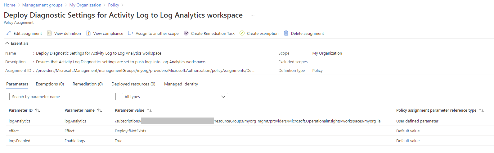
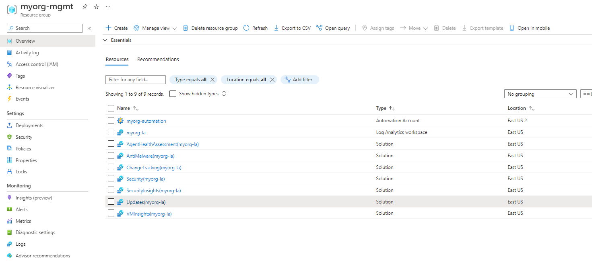

## Overview

This page describes how to deploy Enterprise-scale with the [Management resources][wiki_management_resources] created in the current Subscription context, using custom configuration settings.

The module supports customising almost any part of the configuration, however each subset of resources has it's own configuration block which is designed to simplify setting specific options.
For the Management resources, this is configured through the [`configure_management_resources`][configure_management_resources] input variable.

In this example, we take the base [Deploy Management resources][wiki_deploy_management_resources] configuration and make the following changes:

- Add input variable on the root module for enabling/disabling Management resources
- Add a local variable for `configure_management_resources` and set custom values for the following:
  - Update the retention period for data stored in the Log Analytics workspace from  30 days to 50 days (controlled through an input variable on the root module)
  - Set a valid email address for Security alerts (controlled through an input variable on the root module)
  - Disable Azure Defender for Azure Kubernetes Service (AKS)
  - Set a different location for Management resources (controlled through an input variable on the root module)
  - Add custom resource tags for Management resources (controlled through an input variable on the root module)

The module allows for further customisation of the Management resources through the `advanced` setting, however this is out-of-scope for this example.

> Use of the `advanced` setting is currently undocumented and experimental.
Please be aware that using this setting may result in future breaking changes.

If you've already deployed the [Management resources using default settings][wiki_deploy_management_resources], you will be able to see the changes made when moving to this configuration.

> Due to the way the Azure RM Provider manages dependencies, you may see a number of `azurerm_role_assignment` resources being replaced when updating Policy Assignments.
Unfortunately this is a product limitation, but should have minimal impact due to the way Azure Policy works.

If location is not specified, the resources will default to the same location set by [`default_location`][default_location] input variable.

> IMPORTANT: Ensure the module version is set to the latest, and don't forget to run `terraform init` if upgrading to a later version of the module.


## Example root module

To make the code easier to maintain when extending your configuration, we recommend splitting the root module into multiple files. For the purpose of this example, we use the following:

- [terraform.tf](#terraformtf)
- [variables.tf](#variablestf)
- [main.tf](#maintf)
- [settings.management.tf](#settingsmanagementtf)

> TIP: The exact number of resources created depends on the module configuration, but you can expect upwards of 190 resources to be created by the module for this example.

### `terraform.tf`

The `terraform.tf` file is used to set the provider configuration, including pinning to a specific version (or range of versions) for the AzureRM Provider. For production use, we recommend pinning to a specific version, and not using ranges.

```hcl
# Configure Terraform to set the required AzureRM provider
# version and features{} block.

terraform {
  required_providers {
    azurerm = {
      source  = "hashicorp/azurerm"
      version = ">= 2.77.0"
    }
  }
}

provider "azurerm" {
  features {}
}
```

If you wish to deploy the Management resources to a different Subscription context than the one used for Core resources, please refer to our guide for [Multi-Subscription deployment][wiki_provider_configuration_multi].

### `variables.tf`

The `variables.tf` file is used to declare a couple of example variables which are used to customize deployment of this root module. Defaults are provided for simplicity, but these should be replaced or over-ridden with values suitable for your environment.

```hcl
# Use variables to customize the deployment

variable "root_id" {
  type    = string
  default = "myorg"
}

variable "root_name" {
  type    = string
  default = "My Organization"
}

variable "deploy_management_resources" {
  type    = bool
  default = true
}

variable "log_retention_in_days" {
  type    = number
  default = 50
}

variable "security_alerts_email_address" {
  type    = string
  default = "my_valid_security_contact@replace_me" # Replace this value with your own email address.
}

variable "management_resources_location" {
  type    = string
  default = "uksouth"
}

variable "management_resources_tags" {
  type = map(string)
  default = {
    demo_type = "deploy_management_resources_custom"
  }
}
```

### `main.tf`

The `main.tf` file contains the `azurerm_client_config` resource, which is used to determine the Tenant ID and Subscription ID values from your user connection to Azure. These are used to ensure the deployment will target your `Tenant Root Group` by default, and to populate the `subscription_id_management` input variable.

It also contains the module declaration for this module, containing a number of customisations as needed to meet the specification defined in the overview above.

```hcl
# Get the current client configuration from the AzureRM provider.
# This is used to populate the root_parent_id variable with the
# current Tenant ID used as the ID for the "Tenant Root Group"
# Management Group.

data "azurerm_client_config" "core" {}

# Declare the Terraform Module for Cloud Adoption Framework
# Enterprise-scale and provide a base configuration.

module "enterprise_scale" {
  source  = "Azure/caf-enterprise-scale/azurerm"
  version = "1.1.0"

  providers = {
    azurerm              = azurerm
    azurerm.connectivity = azurerm
    azurerm.management   = azurerm
  }

  root_parent_id = data.azurerm_client_config.core.tenant_id
  root_id        = var.root_id
  root_name      = var.root_name

  deploy_management_resources    = var.deploy_management_resources
  subscription_id_management     = data.azurerm_client_config.core.subscription_id
  configure_management_resources = local.configure_management_resources

}
```

### `settings.management.tf`

The `settings.management.tf` file contains a local variable containing the custom configuration for the `configure_management_resources` input variable.
This helps to keep the module block clean, whilst providing clear separation between settings for different groups of resources.

```hcl
# Configure the management resources settings.
locals {
  configure_management_resources = {
    settings = {
      log_analytics = {
        enabled = true
        config = {
          retention_in_days                           = var.log_retention_in_days
          enable_monitoring_for_arc                   = true
          enable_monitoring_for_vm                    = true
          enable_monitoring_for_vmss                  = true
          enable_solution_for_agent_health_assessment = true
          enable_solution_for_anti_malware            = true
          enable_solution_for_azure_activity          = true
          enable_solution_for_change_tracking         = true
          enable_solution_for_service_map             = true
          enable_solution_for_sql_assessment          = true
          enable_solution_for_updates                 = true
          enable_solution_for_vm_insights             = true
          enable_sentinel                             = true
        }
      }
      security_center = {
        enabled = true
        config = {
          email_security_contact             = var.security_alerts_email_address
          enable_defender_for_acr            = true
          enable_defender_for_app_services   = true
          enable_defender_for_arm            = true
          enable_defender_for_dns            = true
          enable_defender_for_key_vault      = true
          enable_defender_for_kubernetes     = true
          enable_defender_for_oss_databases  = true
          enable_defender_for_servers        = true
          enable_defender_for_sql_servers    = true
          enable_defender_for_sql_server_vms = true
          enable_defender_for_storage        = true
        }
      }
    }

    location = var.management_resources_location
    tags     = var.management_resources_tags
    advanced = null
  }
}
```

## Deployed Management Groups


You have successfully created the default Management Group resource hierarchy, along with the recommended Azure Policy and Access control (IAM) settings for Enterprise-scale.

You have also assigned the current Subscription from your provider configuration to the `management` Management Group.

## Policy Assignment configuration

Check the following Policy Assignments to see how these have been configured with settings matching your Management resources configuration set by `configure_management_resources`:

- Scope = `root`
  - `Deploy-ASCDF-Config`
  - `Deploy-LX-Arc-Monitoring`
  - `Deploy-VM-Monitoring`
  - `Deploy-VMSS-Monitoring`
  - `Deploy-WS-Arc-Monitoring`
  - `Deploy-AzActivity-Log`
  - `Deploy-Resource-Diag`
- Scope = `management`
  - `Deploy-Log-Analytics`

These Policy Assignments should all be assigned with custom parameter values based on your configuration, with `enforcement_mode` correctly set.
Once evaluated, the compliance state should also be updated and you can run remediation tasks to remediate any non-compliant resources.

### Policy Assignment parameters example

The following shows the `Deploy-AzActivity-Log` Policy Assignment with a user-defined value set by the module for the `logAnalytics` parameter.
You will see that this value matches the resource ID of the Log Analytics workspace deployed by this module.



### Policy Assignment compliance

When reviewing the Policy Assignment compliance, you will see that some Policies may need remediation.


## Deployed Management resources

You should also have the following resources deployed in your assigned Management Subscription:



## Additional considerations

If you are using [Archetype Exclusions][archetype_exclusions] or [custom Archetypes][custom_archetypes] in your code, make sure to not disable Log Analytics or Security Center policies if you require policy integration using this module.
The relationship between the resources deployed and the Policy parameters is dependent on [specific Policy Assignments](#policy-assignment-configuration) being used.

## Next steps

Take particular note of the following changes:

- The `retentionInDays` setting is now configured to `50` days on the Log Analytics workspace.
- The `dataRetention` parameter value is also configured to `50` days on the `Deploy-Log-Analytics` Policy Assignment.
- The `emailSecurityContact` parameter value is set to your own email address on the `Deploy-ASCDF-Config` (*Deploy Azure Security Center configuration*) Policy Assignment. Once this policy is remediated, you can also view this setting in Azure Security Center.
- The `pricingTierKubernetesService` parameter value is set to `Free` on the `Deploy-ASCDF-Config` (*Deploy Azure Security Center configuration*) Policy Assignment. In Security Center, you should be able to see that Azure Defender is set to `On` for all resource types except `Kubernetes` <sup>1</sup> which is set to `Off`.

  > <sup>1</sup> - Due to a pending feature addition, Azure Defender is also `Off` for `Open-source relational databases`.
  We plan to add this feature in a future release (date TBC).

Although not Policy Assignment related, also note the following changes:

- All Resource Groups and Resources created by the module for Management are now located in `uksouth`.
- All Resource Groups and Resources ([which support tags][azure_tag_support]) created by the module for Management have the custom tags applied.

Try updating the configuration settings in the `configure_management_resources` local variable to see how this changes your configuration.
Also try setting your own values in the input variables, and toggling the `deploy_management_resources` input variable to see which resources are created/destroyed.

For more information regarding configuration of this module, please refer to the [Module Variables](./%5BUser-Guide%5D-Module-Variables) documentation.

Looking for further inspiration? Why not try some of our other [examples][wiki_examples]?

[//]: # "************************"
[//]: # "INSERT LINK LABELS BELOW"
[//]: # "************************"

[wiki_management_resources]:         ./%5BUser-Guide%5D-Management-Resources "Wiki - Management Resources."
[wiki_deploy_management_resources]:  ./%5BExamples%5D-Deploy-Management-Resources "Wiki - Deploy Management Resources."
[wiki_provider_configuration_multi]: ./%5BUser-Guide%5D-Provider-Configuration#multi-subscription-deployment "Wiki - Provider Configuration - Multi-Subscription deployment."
[wiki_examples]:                     ./Examples "Wiki - Examples"

[configure_management_resources]: ./%5BVariables%5D-configure_management_resources "Instructions for how to use the configure_management_resources variable."
[deploy_management_resources]:    ./%5BVariables%5D-deploy_management_resources "Instructions for how to use the deploy_management_resources variable."
[subscription_id_management]:     ./%5BVariables%5D-subscription_id_management "Instructions for how to use the subscription_id_management variable."
[default_location]:               ./%5BVariables%5D-default_location "Instructions for how to use the default_location variable."
[archetype_exclusions]:           ./%5BExamples%5D-Expand-Built-in-Archetype-Definitions#to-enable-the-exclusion-function "Wiki - Expand Built-in Archetype Definitions # To enable the exclusion function"
[custom_archetypes]:              ./%5BUser-Guide%5D-Archetype-Definitions "[User Guide] Archetype Definitions"

[azure_tag_support]: https://docs.microsoft.com/azure/azure-resource-manager/management/tag-support "Tag support for Azure resources"