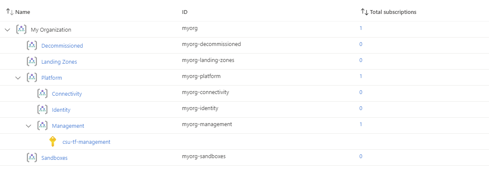
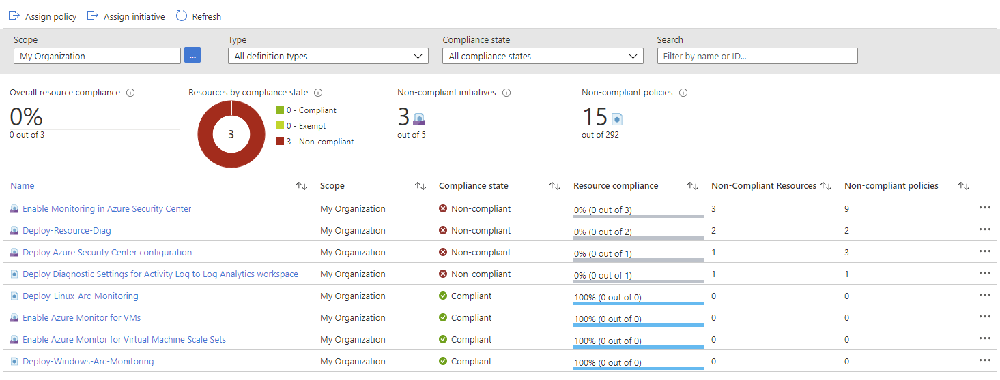
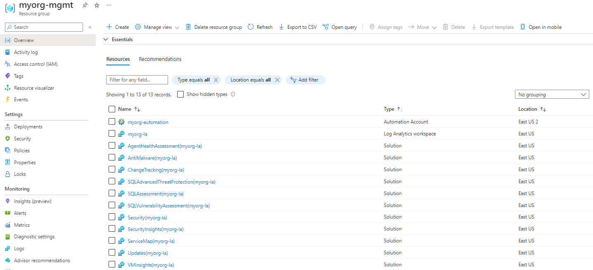

## Overview

This page describes how to deploy Enterprise-scale with the [Management resources][wiki_management_resources] created in the current Subscription context, using the default configuration settings.

In this example, we take the [default configuration][wiki_deploy_default_configuration] and make the following changes:

- Set `deploy_management_resources` to enable creation of the default Management resources,including:
  - Resource Group to contain all Management resources.
  - Log Analytics workspace to use for centralised logging.
  - Automation Account to enable additional capabilities as part of the included Solutions for Azure Monitor.
  - Recommended Solutions for Azure Monitor.
- Set the `subscription_id_management` value to ensure the Subscription is moved to the correct Management Group, and policies are updated with the correct values.

The module updates the `parameters` and `enforcement_mode` for a number of Policy Assignments, to enable features within Log Analytics and Sentinel including but not limited to:
- Enable monitoring for devices managed through Azure Arc;
- Enable monitoring for VMs;
- Enable monitoring for VMSS;
- Enable Azure Defender for various supported services;
- much more...

> IMPORTANT: Ensure the module version is set to the latest, and don't forget to run `terraform init` if upgrading to a later version of the module.


## Example root module

To create the Management resources, `deploy_management_resources` must be set to `true`, and the `subscription_id_management` is also required.

> TIP: The exact number of resources created depends on the module configuration, but you can expect upwards of 190 resources to be created by the module for this example.

To keep this example simple, the root module for this example is based on a single file:

### `main.tf`

```hcl
# We strongly recommend using the required_providers block to set the
# Azure Provider source and version being used.

terraform {
  required_providers {
    azurerm = {
      source  = "hashicorp/azurerm"
      version = ">= 2.77.0"
    }
  }
}

provider "azurerm" {
  features {}
}

# You can use the azurerm_client_config data resource to dynamically
# extract connection settings from the provider configuration.

data "azurerm_client_config" "core" {}

# Call the caf-enterprise-scale module directly from the Terraform Registry
# pinning to the latest version

module "enterprise_scale" {
  source  = "Azure/caf-enterprise-scale/azurerm"
  version = "1.1.0"

  providers = {
    azurerm              = azurerm
    azurerm.connectivity = azurerm
    azurerm.management   = azurerm
  }

  root_parent_id = data.azurerm_client_config.core.tenant_id
  root_id        = "myorg"
  root_name      = "My Organization"

  deploy_management_resources = true
  subscription_id_management  = data.azurerm_client_config.core.subscription_id

}
```

## Deployed Management Groups



You have successfully created the default Management Group resource hierarchy, along with the recommended Azure Policy and Access control (IAM) settings for Enterprise-scale.

You have also assigned the current Subscription from your provider configuration to the `management` Management Group.

## Policy Assignment configuration

Check the following Policy Assignments to see how these have been configured with default settings for parameters and enforcement mode:

- Scope = `root`
  - `Deploy-ASCDF-Config`
  - `Deploy-LX-Arc-Monitoring`
  - `Deploy-VM-Monitoring`
  - `Deploy-VMSS-Monitoring`
  - `Deploy-WS-Arc-Monitoring`
  - `Deploy-AzActivity-Log`
  - `Deploy-Resource-Diag`
- Scope = `management`
  - `Deploy-Log-Analytics`

> You may want to [Deploy Management Resources With Custom Settings][wiki_deploy_management_resources_custom] to change some of these settings.

### Policy Assignment parameters example

The following shows the `Deploy-AzActivity-Log` Policy Assignment with a user-defined value set by the module for the `logAnalytics` parameter.
You will see that this value matches the resource ID of the Log Analytics workspace deployed by this module.


### Policy Assignment compliance

When reviewing the Policy Assignment compliance, you will see that some Policies may need remediation.



## Deployed Management resources

You should also have the following resources deployed in your assigned Management Subscription:



## Additional considerations

If you are using [Archetype Exclusions][archetype_exclusions] or [custom Archetypes][custom_archetypes] in your code, make sure to not disable Log Analytics or Security Center policies if you require policy integration using this module.
The relationship between the resources deployed and the Policy parameters is dependent on [specific Policy Assignments](#policy-assignment-configuration) being used.

## Next steps

Go to our next example to learn how to deploy the [Management resources with custom settings][wiki_deploy_management_resources_custom].

For more information regarding configuration of this module, please refer to the [Module Variables](./%5BUser-Guide%5D-Module-Variables) documentation.

Looking for further inspiration? Why not try some of our other [examples][wiki_examples]?

[//]: # "************************"
[//]: # "INSERT LINK LABELS BELOW"
[//]: # "************************"

[wiki_management_resources]:               ./%5BUser-Guide%5D-Management-Resources "Wiki - Management Resources"
[wiki_deploy_management_resources_custom]: ./%5BExamples%5D-Deploy-Management-Resources-With-Custom-Settings "Wiki - Deploy Management Resources With Custom Settings"
[wiki_examples]:                          ./Examples "Wiki - Examples"
[wiki_deploy_default_configuration]:     ./%5BExamples%5D-Deploy-Default-Configuration "Wiki - Deploy Default Configuration"

[archetype_exclusions]: ./%5BExamples%5D-Expand-Built-in-Archetype-Definitions#to-enable-the-exclusion-function "Wiki - Expand Built-in Archetype Definitions # To enable the exclusion function"
[custom_archetypes]:    ./%5BUser-Guide%5D-Archetype-Definitions "[User Guide] Archetype Definitions"
