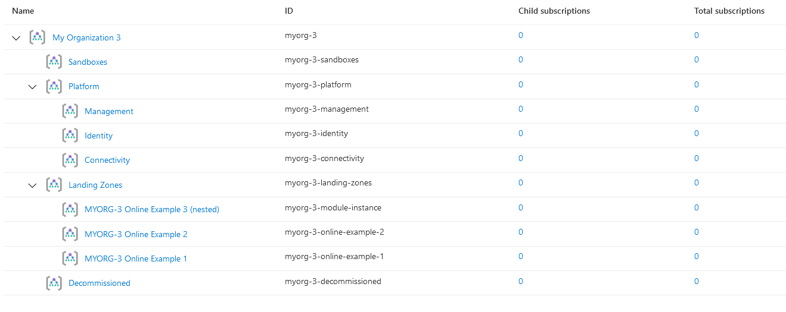

## Overview

This page describes how to deploy Enterprise-scale with a nested module instance. This example is building on top of
[Deploy Custom Landing Zone Archetypes](https://github.com/Azure/terraform-azurerm-caf-enterprise-scale/wiki/%5BExamples%5D-Deploy-Custom-Landing-Zone-Archetypes)
and creates a nested management group, in the previously deployed custom landing zones.

The extra code needed to extend your configuration, is the following:

```hcl

# Enterprise scale nested landing zone instance

module "enterprise_scale_nested_landing_zone" {
  source  = "Azure/caf-enterprise-scale/azurerm"
  version = "1.1.0"

  providers = {
    azurerm              = azurerm
    azurerm.connectivity = azurerm
    azurerm.management   = azurerm
  }


  root_parent_id            = "${var.root_id}-landing-zones"
  root_id                   = var.root_id
  deploy_core_landing_zones = false
  library_path              = "${path.root}/lib"

  custom_landing_zones = {
    "${var.root_id}-module-instance" = {
      display_name               = "${upper(var.root_id)} Online Example 3 (nested)"
      parent_management_group_id = "${var.root_id}-landing-zones"
      subscription_ids           = []
      archetype_config = {
        archetype_id = "customer_online"
        parameters = {}
        access_control = {}
      }
    }
  }

  depends_on = [
    module.enterprise_scale,
  ]

}

```

In this example, we set and update the following values:

- root_parent_id: `${var.root_id}-landing-zones`
- deploy_core_landing_zones: `false`
- display_name: `${upper(var.root_id)} Online Example 3 (nested)`
- depends_on: `module.enterprise_scale`

Check the [`main.tf`](#maintf) example below for the full module declaration.

> IMPORTANT: Ensure the module version is set to the latest, and don't forget to run `terraform init` if upgrading to a later version of the module.


## Example root module

> NOTE: Although only `root_parent_id` is required, we recommend setting `root_id` and `root_name` to something more meaningful. Changing `root_id` will result in the entire deployment to be re-provisioned.

To make the code easier to maintain when extending your configuration, we recommend splitting the root module into multiple files. For the purpose of this example, we use the following:

- [terraform.tf](#terraformtf)
- [variables.tf](#variablestf)
- [main.tf](#maintf)
- [lib/archetype_definition_customer_online.json](#lib-archetype-definition-customer-online-json)

### `terraform.tf`

The `terraform.tf` file is used to set the provider configuration, including pinning to a specific version (or range of versions) for the AzureRM Provider. For production use, we recommend pinning to a specific version, and not using ranges.

```hcl
# Configure Terraform to set the required AzureRM provider
# version and features{} block.

terraform {
  required_providers {
    azurerm = {
      source  = "hashicorp/azurerm"
      version = ">= 2.77.0"
    }
  }
}

provider "azurerm" {
  features {}
}
```

### `variables.tf`

The `variables.tf` file is used to declare a couple of example variables which are used to customize deployment of this root module. Defaults are provided for simplicity, but these should be replaced or over-ridden with values suitable for your environment.

```hcl
# Use variables to customize the deployment

variable "root_id" {
  type    = string
  default = "myorg"
}

variable "root_name" {
  type    = string
  default = "My Organization"
}
```

### `main.tf`

The `main.tf` file contains the `azurerm_client_config` resource, which is used to determine the Tenant ID from your user connection to Azure. This is used to ensure the deployment will target your `Tenant Root Group` by default.

It also contains the module declaration for this module, containing a number of customisations as needed to meet the specification defined in the overview above.

To allow the declaration of custom templates, you must create a custom library folder within the root module and include the path to this folder using the `library_path` variable within the module configuration.

> NOTE: For more information regarding configuration of this module, please refer to the [Module Variables](./%5BUser-Guide%5D-Module-Variables) documentation.

```hcl
# Get the current client configuration from the AzureRM provider.
# This is used to populate the root_parent_id variable with the
# current Tenant ID used as the ID for the "Tenant Root Group"
# Management Group.

data "azurerm_client_config" "core" {}

# Declare the Terraform Module for Cloud Adoption Framework
# Enterprise-scale and provide a base configuration.

module "enterprise_scale" {
  source  = "Azure/caf-enterprise-scale/azurerm"
  version = "1.1.0"

  providers = {
    azurerm              = azurerm
    azurerm.connectivity = azurerm
    azurerm.management   = azurerm
  }

  root_parent_id = data.azurerm_client_config.core.tenant_id
  root_id        = var.root_id
  root_name      = var.root_name
  library_path   = "${path.root}/lib"

  custom_landing_zones = {
    "${var.root_id}-online-example-1" = {
      display_name               = "${upper(var.root_id)} Online Example 1"
      parent_management_group_id = "${var.root_id}-landing-zones"
      subscription_ids           = []
      archetype_config = {
        archetype_id   = "customer_online"
        parameters     = {}
        access_control = {}
      }
    }
    "${var.root_id}-online-example-2" = {
      display_name               = "${upper(var.root_id)} Online Example 2"
      parent_management_group_id = "${var.root_id}-landing-zones"
      subscription_ids           = []
      archetype_config = {
        archetype_id   = "customer_online"
        parameters     = {
          Deny-Resource-Locations = {
            listOfAllowedLocations = ["eastus",]
          }
          Deny-RSG-Locations = {
            listOfAllowedLocations = ["eastus",]
          }
        }
        access_control = {}
      }
    }
  }

}

# Enterprise scale nested landing zone instance

module "enterprise_scale_nested_landing_zone" {
  source  = "Azure/caf-enterprise-scale/azurerm"
  version = "1.1.0"

  providers = {
    azurerm              = azurerm
    azurerm.connectivity = azurerm
    azurerm.management   = azurerm
  }


  root_parent_id            = "${var.root_id}-landing-zones"
  root_id                   = var.root_id
  deploy_core_landing_zones = false
  library_path              = "${path.root}/lib"

  custom_landing_zones = {
    "${var.root_id}-module-instance" = {
      display_name               = "${upper(var.root_id)} Online Example 3 (nested)"
      parent_management_group_id = "${var.root_id}-landing-zones"
      subscription_ids           = []
      archetype_config = {
        archetype_id = "customer_online"
        parameters = {}
        access_control = {}
      }
    }
  }

  depends_on = [
    module.enterprise_scale,
  ]

}
```

### `lib/archetype_definition_customer_online.json`

> IMPORTANT: Please ensure you create this file in the `/lib` directory within your root module.

The `lib/archetype_definition_customer_online.json` file contains a custom "archetype definition". This is a custom JSON format used specifically by the Terraform Module for Cloud Adoption Framework Enterprise-scale.

In this example, we are using this archetype definition to create an archetype called `customer_online`. This archetype definition includes the creation of Policy Assignments for `Deny-Resource-Locations` and `Deny-RSG-Locations`, with default values pre-defined in the archetype definition template.

For more details about working with archetype definitions, please refer to the [archetype definition user guide](./%5BUser-Guide%5D-Archetype-Definitions).

```json
{
  "customer_online": {
    "policy_assignments": ["Deny-Resource-Locations", "Deny-RSG-Locations"],
    "policy_definitions": [],
    "policy_set_definitions": [],
    "role_definitions": [],
    "archetype_config": {
      "parameters": {
        "Deny-Resource-Locations": {
          "listOfAllowedLocations": [
            "eastus",
            "eastus2",
            "westus",
            "northcentralus",
            "southcentralus"
          ]
        },
        "Deny-RSG-Locations": {
          "listOfAllowedLocations": [
            "eastus",
            "eastus2",
            "westus",
            "northcentralus",
            "southcentralus"
          ]
        }
      },
      "access_control": {}
    }
  }
}
```

## Deployed Management Groups



You have successfully created the default Management Group resource hierarchy including additional Management Groups for demonstrating custom Landing Zone archetypes, along with the recommended Azure Policy and Access control (IAM) settings for Enterprise-scale, using module nesting.

> TIP: The exact number of resources created depends on the module configuration, but you can expect upwards of 200 resources to be created by this module for a default installation.
