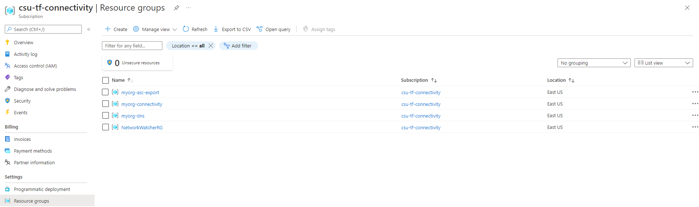
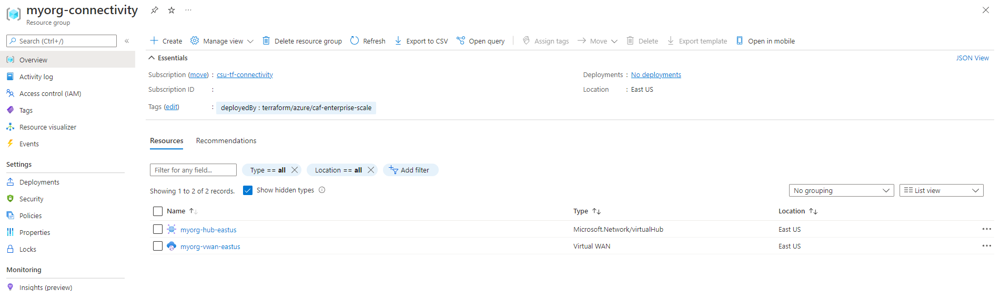

<!-- markdownlint-disable first-line-h1 -->
## Overview

This page describes how to deploy Azure landing zones with connectivity resources based on the [Virtual WAN network topology (Microsoft-managed)][wiki_connectivity_resources_virtual_wan] created in the current Subscription context, using the default configuration settings.

> **NOTE:**
> If you need to deploy a network based on traditional virtual networks, please see our [Deploy Connectivity Resources (Hub and Spoke)][wiki_deploy_connectivity_resources] example.

As connectivity resources can start to significantly increase Azure consumption costs, the module defaults are aimed to help build the basic connectivity configuration whilst minimizing cost.
Please refer to the [Network topology and connectivity][alz_connectivity] recommendations to better understand which of these settings you should enable in a Production environment.

In this example, we take the [default configuration][wiki_deploy_default_configuration] and make the following changes:

- Set `deploy_connectivity_resources` to enable creation of the default connectivity resources.
- Set `subscription_id_connectivity` to ensure the subscription is moved to the correct management group, and policies are updated with the correct values.
- Set `configure_connectivity_resources` to enable creation of the virtual WAN resources.

When `deploy_connectivity_resources` is set to `true`, the module updates the `parameters` and `enforcement_mode` for a number of policy assignments, to enable features relating to the DDoS protection plan and private DNS zones for private endpoints.

<!-- Some private DNS zones for private endpoints are bound to a specific Azure Region.
By default, the module will use the location set for connectivity resources, or the `default_location` value (`eastus`), in order of precedence.
To add more locations, simply add them to the `configure_connectivity_resources.settings.dns.config.private_link_locations` value.
This must be in the short format (`uksouth`), and not DisplayName (`UK South`). -->

> **IMPORTANT:**
> Ensure the module version is set to the latest, and don't forget to run `terraform init` if upgrading to a later version of the module.


## Example root module

To create the Connectivity resources, `deploy_connectivity_resources` must be set to `true`, and the `subscription_id_connectivity` is also required.

Although `subscription_id_connectivity` is required, the subscription used for creation of resources is determined by the [provider configuration][wiki_provider_configuration].
Please ensure you have a provider configured with access to the same subscription specified by `subscription_id_connectivity`, and map this to `azurerm.connectivity` in the module providers object.

As the module is configured to create a [Traditional Azure networking topology (hub and spoke)][wiki_connectivity_resources_hub_and_spoke] by default, this example requires configuration of the `configure_connectivity_resources` input variable.
Although this looks complicated, the value is simply copied from the `default` value used in the variable and updated according to the variable documentation for [Configure hub networks (Virtual WAN)][wiki_configure_hub_networks_virtual_wan].
In this case we perform the following updates:

1. Remove the default value from `configure_connectivity_resources.settings.hub_networks`
1. Update the value of the example entry in `configure_connectivity_resources.settings.vwan_hub_networks.enabled` from `false` to `true`

All other settings are the same as a default deployment.

> **TIP:**
> The exact number of resources created depends on the module configuration, but you can expect upwards of 220 resources to be created by the module for this example.

To keep this example simple, the root module for this example is based on a single file:

### `main.tf`

```hcl
# We strongly recommend using the required_providers block to set the
# Azure Provider source and version being used.

terraform {
  required_providers {
    azurerm = {
      source  = "hashicorp/azurerm"
      version = "~> 3.107"
    }
  }
}

provider "azurerm" {
  features {}
}

# You can use the azurerm_client_config data resource to dynamically
# extract connection settings from the provider configuration.

data "azurerm_client_config" "core" {}

# Call the caf-enterprise-scale module directly from the Terraform Registry
# pinning to the latest version

module "enterprise_scale" {
  source  = "Azure/caf-enterprise-scale/azurerm"
  version = "<version>" # change this to your desired version, https://www.terraform.io/language/expressions/version-constraints

  default_location = "<YOUR_LOCATION>"

  providers = {
    azurerm              = azurerm
    azurerm.connectivity = azurerm
    azurerm.management   = azurerm
  }

  root_parent_id = data.azurerm_client_config.core.tenant_id
  root_id        = "myorg"
  root_name      = "My Organization"

  deploy_connectivity_resources = true
  subscription_id_connectivity  = data.azurerm_client_config.core.subscription_id

  # Configure custom settings for the module to deploy Virtual WAN hub
  # network resources instead of traditional hub network resources.
  configure_connectivity_resources = {
    settings = {
      hub_networks = []
      vwan_hub_networks = [
        {
          enabled = true
          config = {
            address_prefix = "10.200.0.0/22"
            location       = ""
            sku            = ""
            routes         = []
            expressroute_gateway = {
              enabled = false
              config = {
                scale_unit = 1
              }
            }
            vpn_gateway = {
              enabled = false
              config = {
                bgp_settings       = []
                routing_preference = ""
                scale_unit         = 1
              }
            }
            azure_firewall = {
              enabled = false
              config = {
                enable_dns_proxy              = false
                dns_servers                   = []
                sku_tier                      = "Standard"
                base_policy_id                = ""
                private_ip_ranges             = []
                threat_intelligence_mode      = ""
                threat_intelligence_allowlist = {}
                availability_zones = {
                  zone_1 = true
                  zone_2 = true
                  zone_3 = true
                }
              }
            }
            spoke_virtual_network_resource_ids        = []
            secure_spoke_virtual_network_resource_ids = []
            enable_virtual_hub_connections            = false
          }
        },
      ]
      ddos_protection_plan = {
        enabled = false
        config = {
          location = ""
        }
      }
      dns = {
        enabled = true
        config = {
          location = ""
          enable_private_link_by_service = {
            azure_api_management                 = true
            azure_app_configuration_stores       = true
            azure_arc                            = true
            azure_automation_dscandhybridworker  = true
            azure_automation_webhook             = true
            azure_backup                         = true
            azure_batch_account                  = true
            azure_bot_service_bot                = true
            azure_bot_service_token              = true
            azure_cache_for_redis                = true
            azure_cache_for_redis_enterprise     = true
            azure_container_registry             = true
            azure_cosmos_db_cassandra            = true
            azure_cosmos_db_gremlin              = true
            azure_cosmos_db_mongodb              = true
            azure_cosmos_db_sql                  = true
            azure_cosmos_db_table                = true
            azure_data_explorer                  = true
            azure_data_factory                   = true
            azure_data_factory_portal            = true
            azure_data_health_data_services      = true
            azure_data_lake_file_system_gen2     = true
            azure_database_for_mariadb_server    = true
            azure_database_for_mysql_server      = true
            azure_database_for_postgresql_server = true
            azure_digital_twins                  = true
            azure_event_grid_domain              = true
            azure_event_grid_topic               = true
            azure_event_hubs_namespace           = true
            azure_file_sync                      = true
            azure_hdinsights                     = true
            azure_iot_dps                        = true
            azure_iot_hub                        = true
            azure_key_vault                      = true
            azure_key_vault_managed_hsm          = true
            azure_kubernetes_service_management  = true
            azure_machine_learning_workspace     = true
            azure_managed_disks                  = true
            azure_media_services                 = true
            azure_migrate                        = true
            azure_monitor                        = true
            azure_purview_account                = true
            azure_purview_studio                 = true
            azure_relay_namespace                = true
            azure_search_service                 = true
            azure_service_bus_namespace          = true
            azure_site_recovery                  = true
            azure_sql_database_sqlserver         = true
            azure_synapse_analytics_dev          = true
            azure_synapse_analytics_sql          = true
            azure_synapse_studio                 = true
            azure_web_apps_sites                 = true
            azure_web_apps_static_sites          = true
            cognitive_services_account           = true
            microsoft_power_bi                   = true
            signalr                              = true
            signalr_webpubsub                    = true
            storage_account_blob                 = true
            storage_account_file                 = true
            storage_account_queue                = true
            storage_account_table                = true
            storage_account_web                  = true
          }
          private_link_locations                                 = []
          public_dns_zones                                       = []
          private_dns_zones                                      = []
          enable_private_dns_zone_virtual_network_link_on_hubs   = true
          enable_private_dns_zone_virtual_network_link_on_spokes = true
          virtual_network_resource_ids_to_link                   = []
        }
      }
    }
    location = null
    tags     = null
    advanced = null
  }
}
```

## Deployed Management Groups


You have successfully created the default management group resource hierarchy, along with the recommended Azure Policy and Access control (IAM) settings for your Azure landing zone.

You have also assigned the current subscription from your provider configuration to the `connectivity` management group.

## Policy Assignment configuration

Check the following policy assignments to see how these have been configured with default settings for parameters and enforcement mode:

- Scope = `connectivity` and `landing-zones`
  - `Enable-DDoS-VNET`
- Scope = `corp`
  - `Deploy-Private-DNS-Zones`

> You may want to [Deploy Virtual WAN Resources With Custom Settings][wiki_deploy_virtual_wan_resources_custom] to change some of these settings.

## Deployed Connectivity resources

Once deployment is complete and policy has run, you should have the following resource groups deployed in your assigned connectivity subscription:



> **NOTE:**
> `myorg-asc-export` is related to the [management resources][wiki_management_resources].
> This should contain a hidden `microsoft.security/automations` resource `ExportToWorkspace` once the [management resources][wiki_management_resources] are configured and Azure Policy has completed remediation.
> `NetworkWatcherRG` is also automatically generated by the Azure platform when at least one virtual network is created within the subscription.

### Resource Group `myorg-connectivity`

The Resource Group `myorg-connectivity` should be created, and will initially contain a single virtual WAN with the name `myorg-vwan-eastus`.
There will also be a hidden virtual hub resource with the name `myorg-vhub-eastus`.



When you explore the configuration, note that no connectivity settings have been configured.
DDoS Network Protection should also be disabled to reduce costs, although we recommend you **enable this for production environments**.
The location of both the resource group and virtual WAN resources is created in the region specified via the `default_location` input variable, which uses the default value of `eastus` in this example.
These settings can all be changed if needed!

> **NOTE:**
> The module is designed to follow the documented [recommendation to deploy all Virtual WAN resources into a single resource group][about_vwan_single_rsg] regardless of `location` of the virtual WAN resources.
> We therefore omit the location identified from the name for these resources.

### Resource Group `myorg-dns`

As DNS resource are `Global` resources, the resource group is created in the region specified via the `default_location` input variable, which uses the default value of `eastus` in this example.
All private DNS zone resources are `Global`.


By default we create a private DNS zone for all services which currently [support private endpoints][azure_private_endpoint_support].
New private DNS zones may be added in future releases as additional services release private endpoint support.

We also configure `virtual network links` to connect each private DNS zone to traditional hub virtual networks, but this is not currently supported for virtual hubs.
This can be optionally enabled for spoke virtual networks being peered to the virtual hub.

## Additional considerations

If you are using [archetype exclusions][archetype_exclusions] or [custom archetypes][custom_archetypes] in your code, make sure to not disable DDoS or DNS policies if you require policy integration using this module.
The relationship between the resources deployed and the policy parameters are dependent on [specific policy assignments](#policy-assignment-configuration) being used.

## Next steps

Go to our next example to learn how to deploy the [Virtual WAN resources with custom settings][wiki_deploy_virtual_wan_resources_custom].

To learn more about module configuration using input variables, please refer to the [Module Variables][wiki_module_variables] documentation.

Looking for further inspiration? Why not try some of our other [examples][wiki_examples]?

[//]: # "************************"
[//]: # "INSERT LINK LABELS BELOW"
[//]: # "************************"

[alz_connectivity]: https://learn.microsoft.com/azure/cloud-adoption-framework/ready/landing-zone/design-area/network-topology-and-connectivity "Network topology and connectivity for Azure landing zones on the Cloud Adoption Framework."

[azure_private_endpoint_support]: https://learn.microsoft.com/azure/private-link/private-endpoint-dns#azure-services-dns-zone-configuration "Azure services DNS zone configuration"

[about_vwan_single_rsg]: https://learn.microsoft.com/azure/virtual-wan/virtual-wan-faq#can-hubs-be-created-in-different-resource-group-in-virtual-wan

[wiki_module_variables]:                     %5BUser-Guide%5D-Module-Variables "Wiki - Module Variables"
[wiki_provider_configuration]:               %5BUser-Guide%5D-Provider-Configuration "Wiki - Provider Configuration"
[wiki_connectivity_resources_hub_and_spoke]: %5BUser-Guide%5D-Connectivity-Resources#traditional-azure-networking-topology-hub-and-spoke "Wiki - Connectivity Resources - Traditional Azure networking topology (hub and spoke)"
[wiki_connectivity_resources_virtual_wan]:   %5BUser-Guide%5D-Connectivity-Resources#virtual-wan-network-topology-microsoft-managed "Wiki - Connectivity Resources - Virtual WAN network topology (Microsoft-managed)"
[wiki_deploy_connectivity_resources]:        %5BExamples%5D-Deploy-Connectivity-Resources "Wiki - Deploy Connectivity Resources (Hub & Spoke)"
[wiki_deploy_virtual_wan_resources_custom]:  %5BExamples%5D-Deploy-Virtual-WAN-Multi-Region-With-Custom-Settings "Wiki - Deploy multi region networking with custom settings (Virtual WAN)"
[wiki_configure_hub_networks_virtual_wan]:   %5BVariables%5D-configure_connectivity_resources#configure-hub-networks-virtual-wan "Wiki - configure_connectivity_resources - Configure hub networks (Virtual WAN)"
[wiki_examples]:                             Examples "Wiki - Examples"
[wiki_management_resources]:                 %5BUser-Guide%5D-Management-Resources "Wiki - Management Resources"
[wiki_deploy_default_configuration]:         %5BExamples%5D-Deploy-Default-Configuration "Wiki - Deploy Default Configuration"

[archetype_exclusions]: %5BExamples%5D-Expand-Built-in-Archetype-Definitions#to-enable-the-exclusion-function "Wiki - Expand Built-in Archetype Definitions # To enable the exclusion function"
[custom_archetypes]:    %5BUser-Guide%5D-Archetype-Definitions "[User Guide] Archetype Definitions"
