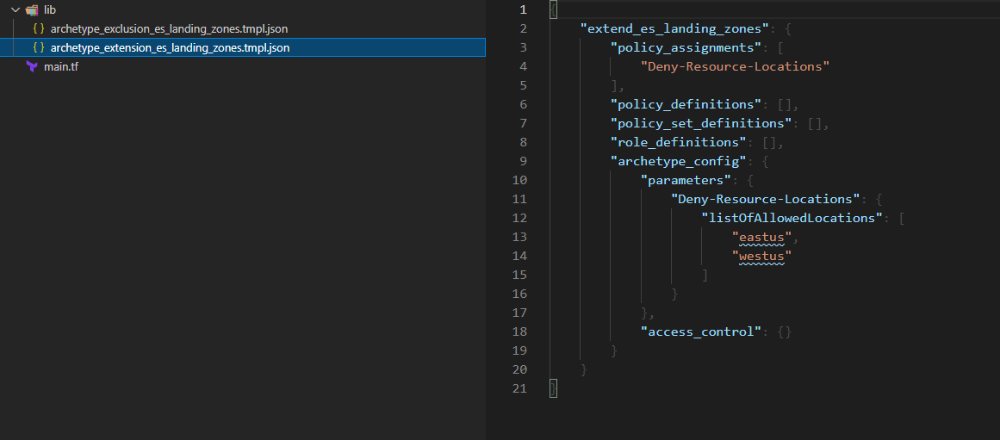
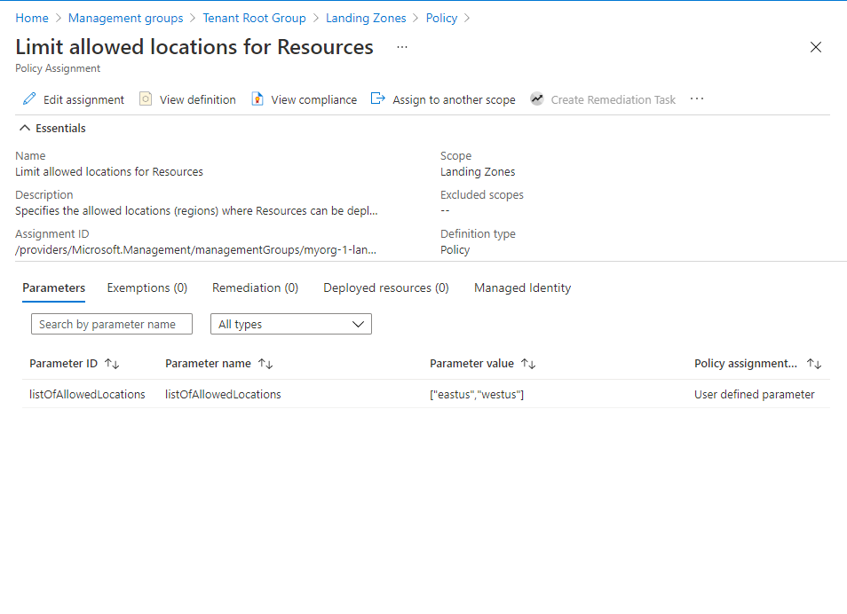
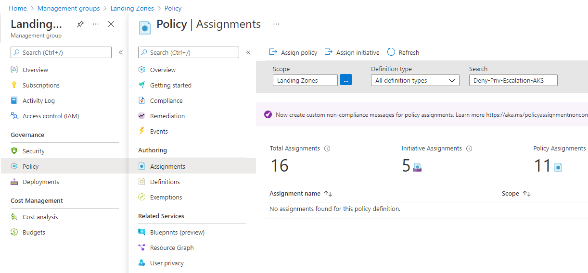

## Overview

This page describes how to deploy Enterprise-scale with a basic configuration based mainly on module defaults.
We then show how to dynamically modify the built-in archetype definitions using the `archetype extensions` and `archetype exclusions`.

> NOTE: This feature is available from version `0.2.0` and also works on your own custom archetype definitions.

We will use the `es_landing_zones` configuration as an example.

The built-in definition contains the following settings:

```json
{
  "es_landing_zones": {
    "policy_assignments": [
      "Deny-IP-Forwarding",
      "Deny-RDP-From-Internet",
      "Deny-Storage-http",
      "Deny-Subnet-Without-Nsg",
      "Deploy-AKS-Policy",
      "Deploy-SQL-DB-Auditing",
      "Deploy-VM-Backup",
      "Deploy-SQL-Security",
      "Deny-Priv-Escalation-AKS",
      "Deny-Priv-Containers-AKS",
      "Deny-http-Ingress-AKS"
    ],
    "policy_definitions": [],
    "policy_set_definitions": [],
    "role_definitions": [],
    "archetype_config": {
      "parameters": {},
      "access_control": {}
    }
  }
}
```

We will update the built-in configuration by adding 2 new settings:

- Create an extension `extend_es_landing_zones` which will **add** a Policy Assignment `Deny-Resource-Locations` and set the parameters of this Policy Assignment.

- Create an exclusion `exclude_es_landing_zones` which will **remove** a set of Policy Assignments `Deny-Priv-Escalation-AKS`, `Deny-Priv-Containers-AKS` and `Deny-http-Ingress-AKS`.

> IMPORTANT: Ensure the module version is set to the latest, and don't forget to run `terraform init` if upgrading to a later version of the module..


## Example root module

To make the code easier to maintain when extending your configuration, we recommend splitting the root module into multiple files.
For the purpose of this example, we use the following:

- [main.tf](#maintf)
- [lib/archetype_extension_es_landing_zones.tmpl.json](#libarchetype_extension_es_landing_zonestmpljson)
- [lib/archetype_exclusion_es_landing_zones.tmpl.json](#libarchetype_exclusion_es_landing_zonestmpljson)



### `main.tf`

The `main.tf` file contains the `azurerm_client_config` resource, which is used to determine the Tenant ID from your user connection to Azure.
This is used to ensure the deployment will target your `Tenant Root Group` by default.

This example code will deploy the minimum recommended management group and subscription organization from the enterprise-scale reference architecture.

To allow the declaration of custom or expanded templates, you must create a custom library folder within the root module and include the path to this folder using the `library_path` variable within the module configuration.
In our example, the directory is `/lib`.

> NOTE: For more information regarding configuration of this module, please refer to the [Module Variables](./%5BUser-Guide%5D-Module-Variables) documentation.

```hcl
# We strongly recommend using the required_providers block to set the
# Azure Provider source and version being used.

terraform {
  required_providers {
    azurerm = {
      source  = "hashicorp/azurerm"
      version = ">= 2.77.0"
    }
  }
}

provider "azurerm" {
  features {}
}

# You can use the azurerm_client_config data resource to dynamically
# extract connection settings from the provider configuration.

data "azurerm_client_config" "core" {}

# Call the caf-enterprise-scale module directly from the Terraform Registry
# pinning to the latest version

module "enterprise_scale" {
  source  = "Azure/caf-enterprise-scale/azurerm"
  version = "1.1.0"

  providers = {
    azurerm              = azurerm
    azurerm.connectivity = azurerm
    azurerm.management   = azurerm
  }

  root_parent_id = data.azurerm_client_config.core.tenant_id
  root_id        = "myorg"
  root_name      = "My Organization"
  library_path   = "${path.root}/lib"

}

```

## To enable the extension function

- In the `/lib` directory create an `**/archetype_extension_*.json` file.

- In the file `**/archetype_extension_*.json` add the `extend_` prefix to the name of the desired built-in archetype definition and your custom settings.

> IMPORTANT: Please ensure you create this file in the `/lib` directory within your root module.

### `lib/archetype_extension_es_landing_zones.tmpl.json`

In this example, we want to add the policy assignment `"Deny-Resource-Locations"` and its related parameters in the built-in archetype `es_landing_zones`

- In the `/lib` directory create an `archetype_extension_es_landing_zones.tmpl.json` file.

  - In the file `archetype_extension_es_landing_zones.tmpl.json` add this code:

```json
{
  "extend_es_landing_zones": {
    "policy_assignments": ["Deny-Resource-Locations"],
    "policy_definitions": [],
    "policy_set_definitions": [],
    "role_definitions": [],
    "archetype_config": {
      "parameters": {
        "Deny-Resource-Locations": {
          "listOfAllowedLocations": ["eastus", "westus"]
        }
      },
      "access_control": {}
    }
  }
}
```

### Extended Policy Assignment



## To enable the exclusion function

- In the `/lib` directory create an `**/archetype_exclusion_*.json` file.

- In the file `**/archetype_exclusion_*.json` add the `exclude_` prefix to the name of the desired built-in archetype definition and your custom settings.

> IMPORTANT: Please ensure you create this file in the `/lib` directory within your root module.

### `lib/archetype_exclusion_es_landing_zones.tmpl.json`

In this example, we want to remove the policy assignments `"Deny-Priv-Escalation-AKS"`, `Deny-Priv-Containers-AKS` and `Deny-http-Ingress-AKS` from the built-in archetype `es_landing_zones`

- In the `/lib` directory create an `archetype_exclusion_es_landing_zones.tmpl.json` file.

  - In the file `archetype_exclusion_es_landing_zones.tmpl.json` add this code:

```json
{
  "exclude_es_landing_zones": {
    "policy_assignments": [
      "Deny-Priv-Escalation-AKS",
      "Deny-Priv-Containers-AKS",
      "Deny-http-Ingress-AKS"
    ],
    "policy_definitions": [],
    "policy_set_definitions": [],
    "role_definitions": [],
    "archetype_config": {
      "parameters": {},
      "access_control": {}
    }
  }
}
```

### Excluded Policy Assignments




## Summary

You have successfully expanded the archetype(s) by adding or removing configuration settings from the built-in archetype definitions for Enterprise-scale.

> TIP: The exact number of resources created depends on the module configuration, but you can expect upwards of 200 resources to be created by this module for a default installation.
