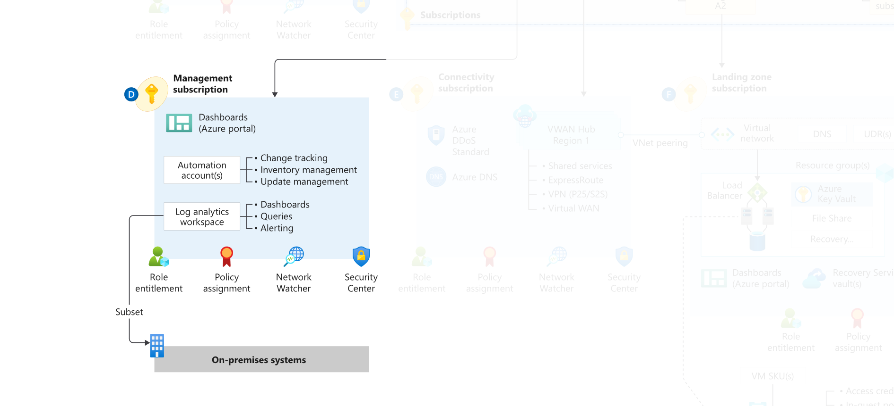

## Overview
This example will deploy resources for centrally managing the Enterprise Scale Landing Zone. This module will deploy the following resources with default configurations that can be adjusted once you are up and going:

   * resource group
   * log analytics workspace
   * automation account 
   * linked service to the analytics automation account

in the subscription of your specification.  

The module then goes onto configure Deploy if Not Exist policies to enable features within Log Analytics and Sentinel including
but not limited to: 
   * enabling monitoring for arc 
   * enabling monitoring for vms
   * enabling monitoring for vmss
   * enabling defender for dns 
   * much more...

A description of each parameter can be found in the chart below:

> IMPORTANT: Ensure the module version is set version  0.2.0 or greater

     module "enterprise_scale" {
      source = "Azure/caf-enterprise-scale/azurerm"
      version = "0.3.1"

If upgrading to a later version of this module, make sure to run `terraform init`

To initiate the resource creation,  `deploy_managagement_resources` must be set to true. The  `subscription_id_management` is a required variable so that the resources have somewhere to land. Enabling these two variables will deploy ~200 resources of which are mostly policies and RBAC roles. 

## Example root module

    data "azurerm_client_config" current {}

    module "enterprise_scale" {
      source = "Azure/caf-enterprise-scale/azurerm"
      version = "0.3.1"

    root_parent_id = data.azurerm_client_config.current.tenant_id
    root_id = "contoso" 
    root_name = "Contoso"
    deploy_management_resources = "true" //where do you set this?
    subscription_id_management = "XXXXXX-XXXX-XXXX-XXXX-XXXXXXX" //Required variable

The module allows for further configuration of log analytics and azure security center by setting the configure_management_resources 
This requires 3 mandatory variables 

     location: //where the resource group will be deployed
     advanced:  [tbd]
     tags: add any specific tag that the resources permit 

For this configuration you must pass in both log analytics and security center. If you want to disable
one or the other, set the enabled flag to false.

    settings = {
      log_analytics = {
        enabled = *false*

If you've already deployed management resources, this will allow you to enable or disable specific parameters. 
Every parameter set to true will create new principal id's that will force replacement in place of the existing 
RBAC and policies to reassign them to the log analytics and sentinel resources. Likewise, if set to false, existing configurations will be removed.  

If location is not specified, the resources will default to *eastus*

    terraform {
      required_providers {
        azurerm = {
            source = "hashicorp/azurerm"
            version = ">=2.46.1"
        }
   
     }
    }

    provider "azurerm"{
    features {}
    }

    #Pull current Tenant ID from connection settings and store to data source
    
    data "azurerm_client_config" current {}

    module "enterprise_scale" {
      source = "Azure/caf-enterprise-scale/azurerm"
      version = "0.3.1"

    root_parent_id = data.azurerm_client_config.current.tenant_id
    root_id = "contoso" 
    root_name = "Contoso"
    deploy_management_resources = "true" //where do you set this?
    subscription_id_management = "5216fe15-ea96-461b-adab-7c589a77ff2d" //This is mandatory for because this is getting controlled by yet another variable I don't have set
    configure_management_resources = {
        settings = {
      log_analytics = {
        enabled = true
        config = {
          retention_in_days                           = 30
          enable_monitoring_for_arc                   = true
          enable_monitoring_for_vm                    = true
          enable_monitoring_for_vmss                  = true
          enable_solution_for_agent_health_assessment = true
          enable_solution_for_anti_malware            = false
          enable_solution_for_azure_activity          = true
          enable_solution_for_change_tracking         = true
          enable_solution_for_service_map             = false
          enable_solution_for_sql_assessment          = true
          enable_solution_for_updates                 = true
          enable_solution_for_vm_insights             = true
          enable_sentinel                             = true
        }
      }
      security_center = {
        enabled = true
        config = {
          email_security_contact             = "email@contoso.com"
          enable_defender_for_acr            = true
          enable_defender_for_app_services   = true
          enable_defender_for_arm            = true
          enable_defender_for_dns            = true
          enable_defender_for_key_vault      = true
          enable_defender_for_kubernetes     = false
          enable_defender_for_servers        = true
          enable_defender_for_sql_servers    = true
          enable_defender_for_sql_server_vms = true
          enable_defender_for_storage        = true
        }
      }
        }
    location = "centralus"
      advanced = null
      tags     = null
      }
    }

You should now have a deployment as seen below

